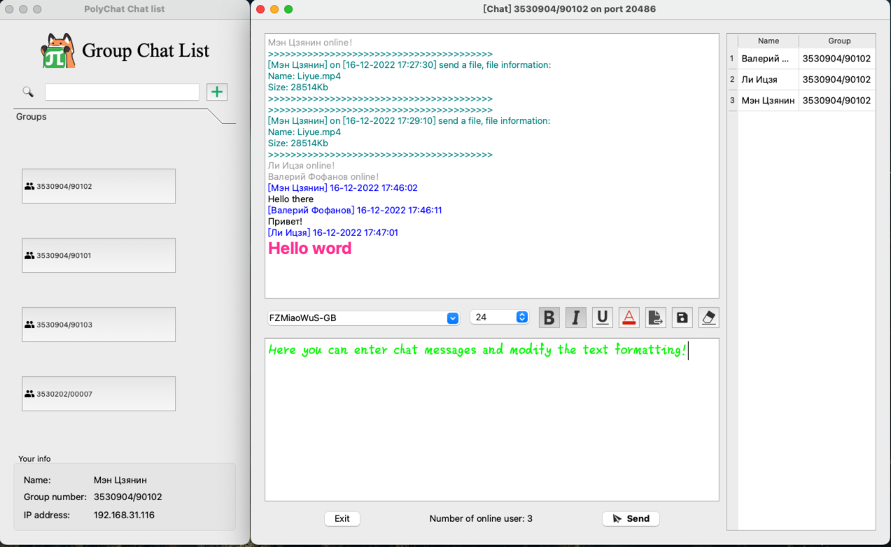
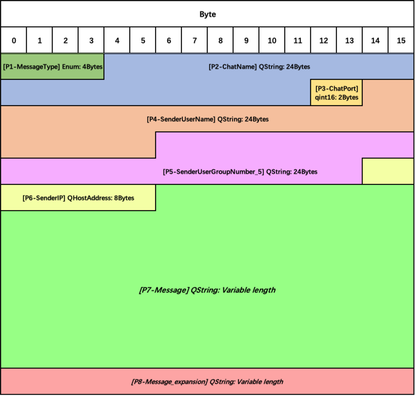
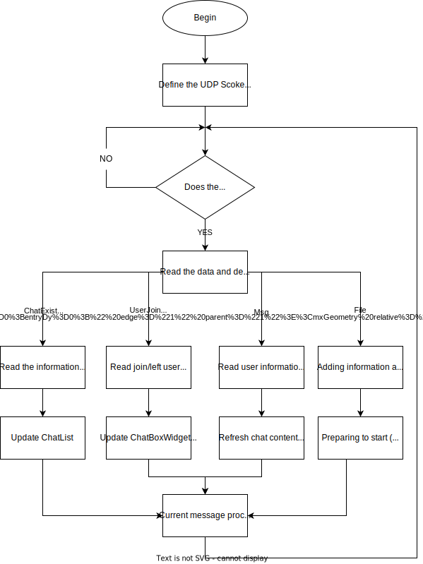
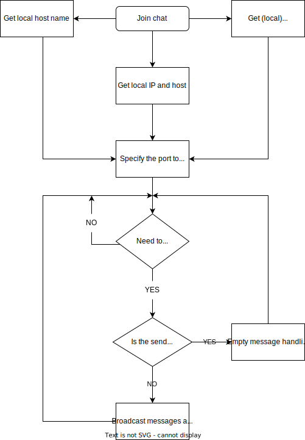
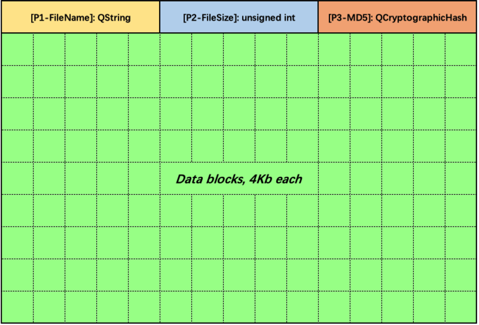
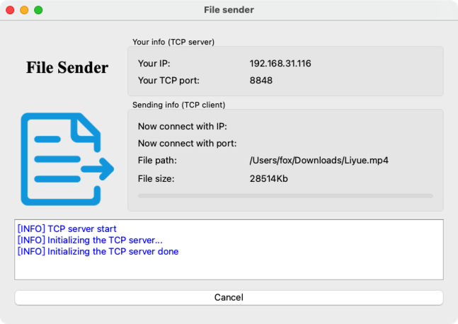
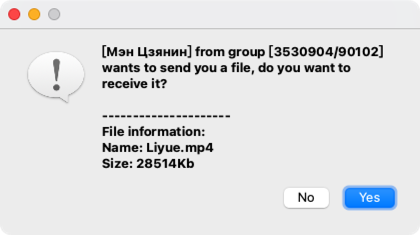
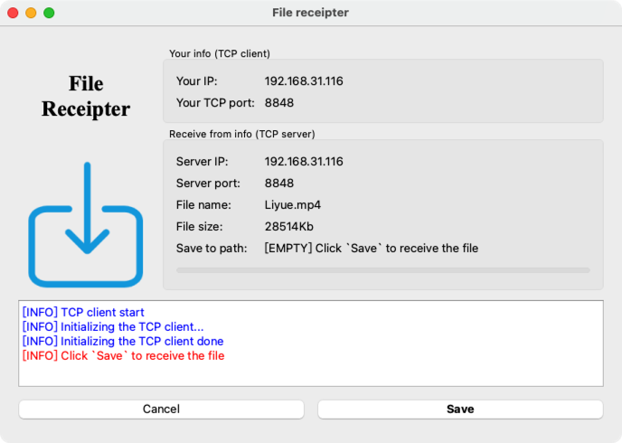

<!-- SPbSTU  -->

    
      
    <b>Санкт-Петербургский государственный политехнический университет</b> 
    <b>Институт компьютерных наук и технологий</b>

<b>PolyChat</b>

<b>Учебный чат</b>

<a href="/doc/README_CN.md">简体中文</a>

<!-- SPbSTU 最后一行 -->

# Содержание

+ [Участники проекта и планирование](#участники-проекта-и-планирование)
+ [Требования](#требования)
  - [Системные требования](#системные-требования)
  - [Технические требования](#технические-требования)
+ [Функциональная спецификация](#функциональная-спецификация)
+ [HLD](#hld)
  - [Дизайн GUI](#дизайн-gui)
    * [Окно авторизации](#окно-авторизации)
    * [Окно списка групповых чатов](#окно-списка-групповых-чатов)
    * [Окно чата](#окно-чата)
  - [Архитектура](#архитектура)
  - [Диаграмма классов](#диаграмма-классов)
  - [Раздел группового чата UDP и список групп](#раздел-группового-чата-udp-и-список-групп)
    * [Собственный протокол взаимодействия UDP](#собственный-протокол-взаимодействия-udp)
    * [Сервер](#сервер)
    * [Клиент](#клиент)
  - [Секция передачи файлов TCP](#секция-передачи-файлов-tcp)
    * [Собственный протокол взаимодействия TCP](#собственный-протокол-взаимодействия-tcp)
    * [Сторона отправителя](#сторона-отправителя)
    * [Сторона получателя](#сторона-получателя)
  - [Потоки данных](#потоки-данных)
+ [Тестирование](#тестирование)
  - [Примечание](#примечание)
  - [Модульное тестирование](#модульное-тестирование)
  - [Интеграционное тестирование](#интеграционное-тестирование)
  - [Системное/End-to-End тестирование](#системноеend-to-end-тестирование)

# Участники проекта и планирование

| Участник        | Ответственность                                                                        |
|-----------------|----------------------------------------------------------------------------------------|
| Валерий Фофанов | Внедрить функциональные модули, написать документацию                                  |
| Ли Ицзя         | Внедрить функциональные модули, поддерживать Канбан                                    |
| Мэн Цзянин      | Дизайн формы, построение и организация каркаса кода, реализация функциональных модулей |

# Требования

## Системные требования

Преподавание в Политехническом университете постепенно переходит от онлайнового к офлайновому обучению. В аудиториях университетов преподаватели часто сталкиваются с проблемами при выдаче заданий или отправке документов студентам. Например, проектор в классе очень нечеткий, студенты на последнем ряду не могут прочитать слова, написанные на доске, преподавателю очень неудобно отправлять документы студентам по учебной сети и часто приходится отвечать на один и тот же вопрос несколько раз для разных студентов.

PolyChat - это кроссплатформенное программное обеспечение для обмена мгновенными сообщениями, предназначенное для решения вышеперечисленных проблем и повышения продуктивности работы преподавателей и студентов. Оно имеет следующие основные характеристики:

- Благодаря закрытому характеру локальной сети, для входа в систему пользователям необходимо указать только свое имя и номер группы, чтобы обеспечить простоту использования и безопасность

- Возможность пользователей быстро создавать групповые чаты и присоединяться к ним, а также отправлять в них сообщения и файлы

- Редактируемое форматирование текстовых сообщений

- Сохранение содержимого сообщения в txt-файл

- Очищение содержимого чата

## Технические требования

Основные технические потребности (требования) следующие:

- Для обеспечения кроссплатформенности разработка будет вестись в Qt

- Чтобы соответствовать философии "высокая сплоченность, низкая связанность", разработка будет вестись с использованием трехуровневой архитектуры, разделяющей уровень представления (UI), уровень бизнес-логики (BLL) и уровень доступа к данным (DAL)

- Qt будет использоваться для кроссплатформенности и масштабируемости

- Для обмена текстовыми сообщениями используется протокол UDP, а для передачи файлов - протокол TCP

- Когда пользователь отправляет сообщение, оно транслируется на порт

- Socket UDP привязывается за фиксированным портом, а сигнал и слот используются для прослушивания входящих данных

# Функциональная спецификация

| Идентификатор                | Требование                                                                                                                                                                                                                                                                                |
|------------------------------|-------------------------------------------------------------------------------------------------------------------------------------------------------------------------------------------------------------------------------------------------------------------------------------------|
| Login_Deficient              | Если имя и/или номер группы не введены, будет выведено уведомление с текстом ошибки                                                                                                                                                                                                       |
| Login_Minimize               | При нажатии на кнопку минимизации окно сворачивается                                                                                                                                                                                                                                      |
| Login_Exit                   | При нажатии на кнопку закрытия происходит выход из основной программы                                                                                                                                                                                                                     |
|                              |                                                                                                                                                                                                                                                                                           |
| DialogList_Load              | При успешном входе пользователя в систему будет вызван список чатов (групповой чат в локальной сети) и загружен соответствующий файл ресурсов                                                                                                                                             |
| DialogList_Add_Chat          | Пользователи могут нажать на кнопку "Плюс", чтобы указать имя группового чата во всплывающем диалоговом окне, и будет создан групповой чат с таким именем. После создания нового группового чата список групповых чатов будет обновлен, чтобы добавить только что созданный групповой чат |
| DialogList_Add_Chat_Clash    | Если групповой чат с определенным именем уже существует, при попытке создать его снова появится уведомление с сообщением об ошибке                                                                                                                                                        |
| DialogList_View              | Пользователи могут использовать колесико мыши для просмотра содержимого списка                                                                                                                                                                                                            |
| DialogList_Select            | Пользователи могут выбрать групповой чат из списка чатов                                                                                                                                                                                                                                  |
| DialogList_Search            | Пользователи могут искать групповой чат по его названию через поисковую строку                                                                                                                                                                                                            |
| DialogList_Join              | При нажатии (выборе) группового чата в списке чатов, пользователь присоединится к групповому чату и появится окно чата                                                                                                                                                                    |
| DialogList_Join_Clash        | Когда пользователь присоединился к групповому чату, при повторном присоединении будет выведено уведомление с текстом ошибки                                                                                                                                                               |
| DialogList_Minimize          | При нажатии на кнопку минимизации окно сворачивается                                                                                                                                                                                                                                      |
| DialogList_Maximize          | При нажатии на кнопку полного экрана окно разворачивается на весь экран                                                                                                                                                                                                                   |
| DialogList_Exit              | При нажатии на кнопку закрытия происходит выход из основной программы                                                                                                                                                                                                                     |
|                              |                                                                                                                                                                                                                                                                                           |
| ChatWidget_Text_Font_Type    | (Выделить текст) Изменить шрифт в раскрывающемся списке. Шрифты, которые можно изменять, - это шрифты, уже установленные на компьютере                                                                                                                                                    |
| ChatWidget_Text_Font_Size    | (Выделить текст) Изменить размер текста в раскрывающемся списке, размер шрифта от 12 до 28                                                                                                                                                                                                |
| ChatWidget_Text_Font_B       | (Выделить текст) Нажатие на кнопку "Жирный" сделает текст жирным                                                                                                                                                                                                                          |
| ChatWidget_Text_Font_I       | (Выделить текст) Нажатие на кнопку "Курсив" сделает текст наклонным                                                                                                                                                                                                                       |
| ChatWidget_Text_Font_L       | (Выделить текст) Нажатие на кнопку "Подчеркивание" добавит подчеркивание в нижнюю часть текста                                                                                                                                                                                            |
| ChatWidget_Mess_View         | Пользователи могут использовать колесико мыши для просмотра журналов чата                                                                                                                                                                                                                 |
| ChatWidget_Mess_Clean        | Нажатие на кнопку "Очистить чат" очистит все журналы чата в своем окне, содержимое окон других пользователей не затрагивается                                                                                                                                                             |
| ChatWidget_Mess_Save         | Нажатие на кнопку "Сохранить" сохранит журнал чата в виде txt-файла                                                                                                                                                                                                                       |
| ChatWidget_Mess_Send         | Нажатие на кнопку "Отправить" отправит текст в поле ввода в групповой чат                                                                                                                                                                                                                 |
| ChatWidget_Mess_Send_Empty   | Когда поле ввода текста пустое, нажатие на кнопку "Отправить" ничего не отправляет                                                                                                                                                                                                        |
| ChatWidget_File_Send         | Пользователи могут выбрать файл и отправить его в групповой чат                                                                                                                                                                                                                           |
| ChatWidget_File_Send_Large   | Если размер файла превышает 1 Гб, он не будет отправлен                                                                                                                                                                                                                                   |
| ChatWidget_File_Receive      | Когда пользователь отправляет файл, другие пользователи могут выбирать, принимать его или нет                                                                                                                                                                                             |
| ChatWidget_File_Receive_Path | Если пользователь решит получить файл, то он может выбрать, где его сохранить                                                                                                                                                                                                             |
| ChatWidget_User_In           | Когда пользователь присоединяется к групповому чату, все пользователи получают сообщение                                                                                                                                                                                                  |
| ChatWidget_User_Out          | Пользователь, нажавший на кнопку выхода, выйдет из группового чата, в то время как другие пользователи не пострадают                                                                                                                                                                      |
| ChatWidget_User_Out_Mess     | Когда пользователь покидает групповой чат, все получают сообщение о том, что пользователь покинул чат                                                                                                                                                                                     |
| ChatWidget_Minimize          | При нажатии кнопки минимизации окно сворачивается                                                                                                                                                                                                                                         |
| ChatWidget_Maximize          | При нажатии на кнопку полного экрана окно разворачивается на весь экран                                                                                                                                                                                                                   |

# HLD

## Дизайн GUI

### Окно авторизации

### Окно списка групповых чатов

### Окно чата

## Архитектура

Мы используем диаграмму Use Case для представления архитектуры программного обеспечения PolyChat:

## Диаграмма классов

В PolyChat существует 3 класса: список групп, группа и пользователь. Их взаимосвязь показана на диаграмме ниже:

## Раздел группового чата UDP и список групп

Это приложение реализует следующую функциональность: в пределах локальной сети пользователи могут добавить (создать) групповой чат, и когда групповой чат создан, список групповых чатов на других хостах синхронизируется и обновляется (через UDP).

После добавления каждого пользователя в групповой чат, в правой части экрана группового чата может быть отображен список онлайн-пользователей, показывающий имя пользователя, номер класса и ip-адрес соответственно. Слева от формы отображается содержание чата, т.е. групповой чат. Каждый человек может ввести текст (и изменить формат текста) и отправить его с экрана ввода чата.

UDP-сообщения передаются по локальной сети с помощью механизма `Broadcast` и для удобства использования дополнены `ShareAddress` и `ReuseAddressHint`, которые описаны ниже.

- `Broadcast`: широковещательная передача на все порты текущей локальной сети

- `ShareAddress`: позволяет другим службам связываться с тем же адресом и портом. Это полезно, когда несколько процессов разделяют нагрузку на службу, прослушивая один и тот же адрес и порт (например, веб-сервер с несколькими предварительно вилочными слушателями может значительно улучшить время отклика). Однако, поскольку любой службе разрешено перепривязываться, этот вариант должен учитывать некоторые вопросы безопасности. Поэтому, комбинируя эту опцию с `ReuseAddressHint`.

- `ReuseAddressHint`: он должен попытаться перепривязать сервис, даже если адрес и порт уже привязаны другим сокетом.

### Собственный протокол взаимодействия UDP

Для достижения вышеуказанной функциональности и обеспечения последующей расширяемости программы. Используется индивидуальный протокол связи, в котором 8 блоков.

- `Блок 1`: типы сообщений. В настоящее время существует 6 типов.
    - `ChatExist`: текущее окно группового чата существует и транслируется через регулярные промежутки времени
    - `ChatDestory`: удаляет текущий групповой чат, отправляется, когда все (последние) участники группового чата покинули его.
    - `Msg`: обычное текстовое сообщение
    - `File`: запрос на отправку файла
    - `UserJoin`: пользователь присоединяется к текущему групповому чату
    - `UserLeft`: пользователь покидает текущий групповой чат

- `Блок 2`: название текущего группового чата
- `Блок 3`: порт, на котором находится текущий групповой чат
- `Блок 4`: имя пользователя, отправившего это сообщение
- `Блок 5`: группы пользователя, отправившего это сообщение
- `Блок 6`: IP-адрес пользователя, отправившего это сообщение
- `Блок 7`: содержание сообщения (переменной длины)
- `Блок 8`: содержание сообщения (переменной длины, используется для расширения параграфа 7)

Как показано на диаграмме ниже:

### Сервер

> **Примечание: Система чата в PolyChat похожа на P2P, в том смысле, что пользователь может выступать как в роли сервера, так и в роли клиента. Один пользователь может выступать в качестве и сервера, и клиента. **

После создания UDP-сокета и привязки его к фиксированному порту, сервер отслеживает входящие данные, используя сигналы и слоты. Если появляется сообщение, он получает данные и анализирует тип сообщения. Если сообщение является входом нового пользователя, сервер обновляет список пользователей и добавляет уведомление о новом пользователе онлайн в окно отображения чата; аналогично, если пользователь находится в автономном режиме, сервер удаляет пользователя из списка пользователей и отображает уведомление об автономном режиме в окне отображения чата; если это сообщение чата, он получает сообщение и отображает его в окне. Технологическая схема выглядит следующим образом.

### Клиент

> **Примечание: Система чата в PolyChat похожа на P2P, в том смысле, что пользователь может выступать как в роли сервера, так и в роли клиента. Один пользователь может выступать в качестве и сервера, и клиента. **

Когда пользователь присоединяется к групповому чату, имя пользователя, номер группы, имя хоста и ip-адрес получаются и передаются на LAN-сервер (ChatBoxWidget) для обновления списка пользователей справа. Затем, когда клиенту нужно отправить сообщение, он вводит его в поле ввода чата и нажимает кнопку отправки, чтобы отправить чат, одновременно транслируя различные сообщения из локальной системы. Технологическая схема выглядит следующим образом：

## Секция передачи файлов TCP

### Собственный протокол взаимодействия TCP

TCP использует специализированный протокол связи, в котором есть 4 части.

Части с 1 по 3 - это заголовки файлов, а часть 4 - собственно данные.

- `Часть 1`: Имя файла
- `Часть 2`: размер файла (байт)
- `Часть 3`: MD5 файла
- `Часть 4`: данные (4 Кб на блок)

При передаче сервер сначала отправляет заголовок файла. Для предотвращения "липких" пакетов TCP, подождите 20 мс перед началом отправки блока данных

### Сторона отправителя

> ***Сторона отправителя берет на себя роль сервера.***

Нажмите на кнопку Отправить, выберите файл для отправки на локальном компьютере, нажмите на кнопку Отправить, появится экран Отправителя, затем индикатор выполнения покажет информацию о файле, который в данный момент отправляется, ход передачи, подключенного в данный момент клиента и другую информацию. Если вы хотите закрыть процесс отправки, нажмите кнопку Закрыть. Технологическая схема выглядит следующим образом:

### Сторона получателя

> ***Сторона получателя берет на себя роль клиента.***

В интерфейсе появится диалоговое окно с вопросом, хотите ли вы принять сообщение о передаче файла от конкретного пользователя, если да, нажмите кнопку Yes, в противном случае нажмите кнопку No.

После того как вы выбрали каталог и имя файла, в котором вы хотите получить файл, вы начнете получать файл, в процессе также будет отображаться ход передачи файла, информация о получателе и клиенте. Интерфейс на принимающей стороне показан ниже:

Технологическая схема выглядит следующим образом:

## Потоки данных

Мы используем диаграмму потоков данных для представления обработки сообщений, полученных в окне группового чата PolyChat:

# Тестирование

## Примечание

PolyChat будет тестироваться с помощью QTest.

QTestlib — это среда модульного тестирования, предоставляемая Qt для программ или библиотек, написанных на основе Qt. QTestLib предоставляет базовые функции среды модульного тестирования и расширенные функции для тестирования графического интерфейса. Ниже перечислены особенности QTestlib:

A. Легкость: QTestlib содержит только 6000 строк кода и 60 экспортируемых символов.
B. Автономность: для тестов без графического интерфейса QTestlib требуется только несколько символов базовой библиотеки Qt.
C. Быстрота тестирования: QTestlib не требует специальной исполнительной программы тестирования и не требует специальной регистрации для тестирования.
D. Тестирование на основе данных: тестовая программа может выполняться несколько раз на разных наборах тестовых данных.
E. Базовое тестирование GUI: QTestlib предоставляет функцию имитации событий мыши и клавиатуры.
F. Контрольное тестирование: QTestlib поддерживает контрольное тестирование и предоставляет различные средства измерения.
G. Совместимость с IDE: выходные данные QTestlib могут быть проанализированы Visual Studio и KDevelop.
H. Безопасность потоков: отчеты об ошибках являются потокобезопасными и атомарными.
J. Безопасность типов: шаблон расширен для предотвращения ошибок, вызванных неявным преобразованием типов.
K. Простота расширения: определяемые пользователем типы могут быть легко добавлены к тестовым данным и тестовым результатам.

Тесты должны выполняться автоматически, когда проект собирается с помощью компоновщика qmake, создающего исполняемый файл. Используя CI/CD на GitHub, триггеры будут автоматически собирать и тестировать код на платформах Windows и macOS при изменении кода (одновременное тестирование на обеих платформах обеспечивает кроссплатформенный характер PolyChat).

## Модульное тестирование

|     | Название тестирования          | Аффилированные модули | Описание (ожидаемые результаты)                                                                                                                              |
|-----|--------------------------------|-----------------------|--------------------------------------------------------------------------------------------------------------------------------------------------------------|
| 1   | ut_login_login_empty           | Login                 | Сбой входа в систему (имя пользователя не может быть пустым).                                                                                                |
| 2   | ut_login_group_empty           | Login                 | Сбой входа в систему (номер группы не может быть пустым).                                                                                                    |
| 3   | ut_login_login_group_empty     | Login                 | Сбой входа в систему (имя пользователя и номер группы не могут быть пустыми).                                                                                |
| 4   | ut_login_init_login            | Login                 | Локальная информация инициализируется правильно путем передачи имени пользователя в правильном формате.                                                      |
| 5   | ut_login_init_group            | Login                 | Локальная информация инициализируется правильно путем передачи номера группы в правильном формате.                                                           |
| 6   | ut_login_btnlogin              | Login                 | btnlogin является отмечаемой кнопкой (Checkable-QToolButton), а отображение icon отключено.                                                                  |
| 7   | ut_login_btnlogin_emit         | Login                 | Вход в систему. Сигнал (нажатие кнопки) входа в систему каждый раз срабатывает правильно и единожды.                                                         |
| 8   | ut_login_btnInfo_emit          | Login                 | Каждый раз, когда пользователь нажимает на btnInfo, сигнал (нажатие кнопки) гарантированно срабатывает правильно и единожды.                                 |
| 9   | ut_login_window                | Login                 | Размер Login отключен и составляет 400x250.                                                                                                                  |
| 10  | ut_addchat_btnCancelAddChat    | Add Chat              | Каждый раз, когда пользователь нажимает кнопку отмены, сигнал (нажатие кнопки) срабатывает правильно и единожды.                                             |
| 11  | ut_addchat_btnAddChat          | Add Chat              | Каждый раз, когда пользователь нажимает кнопку добавления, сигнал (нажатие кнопки) срабатывает правильно и единожды.                                         |
| 12  | ut_chat_init                   | Chat(Class)           | Правильно инициализируется (используя конструктор) объект Chat.                                                                                              |
| 13  | ut_chatlist_init               | ChatList              | Правильно инициализируется (используя конструктор) объект ChatList.                                                                                          |
| 14  | ut_chatlist_btnNewChat         | ChatList              | btnNewChat является отмечаемой кнопкой (Checkable-QToolButton), а отображение текста отключено.                                                              |
| 15  | ut_chatlist_btnNewChat_emit    | ChatList              | Каждый раз, когда пользователь нажимает кнопку, чтобы добавить групповой чат, сигнал (нажатие кнопки) срабатывает правильно и единожды.                      |
| 16  | ut_chatlist_leSearch           | ChatList              | Моделируется то, как пользователь нажимает и печатает на клавиатуре, чтобы убедиться, что вводимое содержимое правильно отображается в поле поиска leSearch. |
| 17  | ut_chatlist_lbName             | ChatList              | Имя пользователя текущего пользователя правильно отображается в lbName.                                                                                      |
| 18  | ut_chatlist_lbGroupNumber      | ChatList              | Номер группы текущего пользователя правильно отображается в lbGroupNumber.                                                                                   |
| 19  | ut_chatlist_lbIP               | ChatList              | IP-адрес текущего пользователя корректно отображается в lbIP.                                                                                                |
| 20  | ut_addchat_port_exist          | ChatList              | Возвращает true (групповой чат уже существует на текущем порту).                                                                                             |
| 21  | ut_addchat_port_not_exist      | ChatList              | Возвращает false (групповой чат не существует на текущем порту).                                                                                             |
| 22  | ut_addchat_chat_exist          | ChatList              | Возвращает true (групповой чат с таким названием уже существует).                                                                                            |
| 23  | ut_addchat_chat_not_exist      | ChatList              | Возвращает false (групповой чат с таким названием не существует).                                                                                            |
| 24  | ut_chatlist_chat_not_open      | ChatList              | Возвращает true (если групповой чат с таким названием не открыт).                                                                                            |
| 25  | ut_chatlist_chat_open          | ChatList              | Возвращает false (если открыт групповой чат с таким названием).                                                                                              |
| 26  | ut_tcpclient_lbClientIP        | TcpClient             | Содержимое lbClientIP правильно анализируется и отображается                                                                                                 |
| 27  | ut_tcpclient_lbClientPort      | TcpClient             | Содержимое lbClientPort правильно анализируется и отображается.                                                                                              |
| 28  | ut_tcpclient_lbServerIP        | TcpClient             | Содержимое lbServerIP правильно анализируется и отображается.                                                                                                |
| 29  | ut_tcpclient_lbServerPort      | TcpClient             | Содержимое lbServerPort правильно анализируется и отображается.                                                                                              |
| 30  | ut_tcpclient_lbFileName        | TcpClient             | Содержимое lbFileName правильно анализируется и отображается.                                                                                                |
| 31  | ut_tcpclient_lbFileSize        | TcpClient             | Содержимое lbFileSize правильно анализируется и отображается.                                                                                                |
| 32  | ut_tcpclient_progressBar       | TcpClient             | progressBar инициализирован 0.                                                                                                                               |
| 33  | ut_tcpclient_btnCancel         | TcpClient             | btnCancel является отмечаемой кнопкой (Checkable-QToolButton).                                                                                               |
| 34  | ut_tcpclient_btnCancel_emit    | TcpClient             | Каждый раз, когда пользователь нажимает кнопку отмены, сигнал (нажатие кнопки) срабатывает правильно и единожды.                                             |
| 35  | ut_tcpclient_btnSave           | TcpClient             | btnSave является отмечаемой кнопкой (Checkable-QToolButton).                                                                                                 |
| 36  | ut_tcpclient_btnSave_emit      | TcpClient             | Каждый раз, когда пользователь нажимает кнопку сохранения, сигнал (нажатие кнопки) срабатывает правильно и единожды.                                         |
| 37  | ut_tcpclient_closeEvent_emit   | TcpClient             | Запускает событие закрытия, когда пользователь закрывает окно.                                                                                               |
| 38  | ut_tcpclient_textBrowser       | TcpClient             | textBrowser доступен только для чтения, запись запрещена.                                                                                                    |
| 39  | ut_tcpserver_lbClientIP        | TcpServer             | Содержимое lbClientIP правильно анализируется и отображается.                                                                                                |
| 40  | ut_tcpserver_lbClientPort      | TcpServer             | Содержимое lbClientPort правильно анализируется и отображается.                                                                                              |
| 41  | ut_tcpserver_lbServerIP        | TcpServer             | Содержимое lbServerIP правильно анализируется и отображается.                                                                                                |
| 42  | ut_tcpserver_lbServerPort      | TcpServer             | Содержимое lbServerPort правильно анализируется и отображается.                                                                                              |
| 43  | ut_tcpserver_lbFilePath        | TcpServer             | Содержимое lbFilePath правильно анализируется и отображается.                                                                                                |
| 44  | ut_tcpserver_lbFileSize        | TcpServer             | Содержимое lbFileSize правильно анализируется и отображается.                                                                                                |
| 45  | ut_tcpserver_btnCancel         | TcpServer             | btnCancel является отмечаемой кнопкой (Checkable-QToolButton).                                                                                               |
| 46  | ut_tcpserver_btnCancel_emit    | TcpServer             | Каждый раз, когда пользователь нажимает кнопку отмены, сигнал (нажатие кнопки) срабатывает правильно и единожды.                                             |
| 47  | ut_tcpserver_progressBar       | TcpServer             | progressBar инициализирован 0.                                                                                                                               |
| 48  | ut_tcpserver_closeEvent_emit   | TcpServer             | Запускает событие закрытия, когда пользователь закрывает окно.                                                                                               |
| 49  | ut_tcpserver_textBrowser       | TcpServer             | textBrowser позволяет писать.                                                                                                                                |
| 50  | ut_chatbox_title               | ChatBox               | Заголовок окна ChatBox инициализирован корректно (соответствует формату).                                                                                    |
| 51  | ut_chatbox_btnBold             | ChatBox               | btnBold является отмечаемой кнопкой (Checkable-QToolButton), а отображение текста отключено.                                                                 |
| 52  | ut_chatbox_btnItalic           | ChatBox               | btnItalic является отмечаемой кнопкой (Checkable-QToolButton), а отображение текста отключено.                                                               |
| 53  | ut_chatbox_btnUnderLine        | ChatBox               | btnUnderLine является отмечаемой кнопкой (Checkable-QToolButton), а отображение текста отключено.                                                            |
| 54  | ut_chatbox_btnColor            | ChatBox               | btnColor не является отмечаемой кнопкой (Checkable-QToolButton), а отображение текста отключено.                                                             |
| 55  | ut_chatbox_btnFileSend         | ChatBox               | btnFileSend не является отмечаемой кнопкой (Checkable-QToolButton), а отображение текста отключено.                                                          |
| 56  | ut_chatbox_btnSave             | ChatBox               | btnSave не является отмечаемой кнопкой (Checkable-QToolButton), а отображение текста отключено.                                                              |
| 57  | ut_chatbox_btnClean            | ChatBox               | btnClean не является отмечаемой кнопкой (Checkable-QToolButton), а отображение текста отключено.                                                             |
| 58  | ut_chatbox_btnExit             | ChatBox               | Кнопка btnExit не является проверяемой.                                                                                                                      |
| 59  | ut_chatbox_btnSend             | ChatBox               | Кнопка btnSend не является проверяемой.                                                                                                                      |
| 60  | ut_chatbox_btnBold_emit        | ChatBox               | Нажатие btnBold активирует сигнал (нажатие кнопки), и состояние изменяется на «включено»; нажатие еще раз возвращает в исходное состояние.                   |
| 61  | ut_chatbox_btnItalic_emit      | ChatBox               | Нажатие btnItalic активирует сигнал (нажатие кнопки), и состояние изменяется на «включено»; нажатие еще раз возвращает в исходное состояние.                 |
| 62  | ut_chatbox_btnUnderLine_emit   | ChatBox               | Нажатие btnUnderLine активирует сигнал (нажатие кнопки), и состояние изменяется на «включено»; нажатие еще раз возвращает в исходное состояние.              |
| 63  | ut_chatbox_btnColor_emit       | ChatBox               | Нажатие btnColor запускает сигнал (нажатие кнопки).                                                                                                          |
| 64  | ut_chatbox_btnFileSend_emit    | ChatBox               | Нажатие btnFileSend запускает сигнал (нажатие кнопки).                                                                                                       |
| 65  | ut_chatbox_btnSave_emit        | ChatBox               | Нажатие кнопки btnSave запускает сигнал (нажатие кнопки).                                                                                                    |
| 66  | ut_chatbox_btnClean_emit       | ChatBox               | Нажатие кнопки btnClean запускает сигнал (нажатие кнопки).                                                                                                   |
| 67  | ut_chatbox_btnExit_emit        | ChatBox               | Нажатие кнопки btnExit запускает сигнал (нажатие кнопки).                                                                                                    |
| 68  | ut_chatbox_btnSend_emit        | ChatBox               | Нажатие кнопки btnSend запускает сигнал (нажатие кнопки).                                                                                                    |
| 69  | ut_chatbox_msgTextBrowser      | ChatBox               | msgTextBrowser доступен только для чтения.                                                                                                                   |
| 70  | ut_chatbox_msgTextEdit         | ChatBox               | msgTextEdit позволяет писать.                                                                                                                                |
| 71  | ut_chatbox_init_cbxFontSize    | ChatBox               | Начальный шрифт 12.                                                                                                                                          |
| 72  | ut_chatbox_cbxFontSize_min_max | ChatBox               | Минимальный размер шрифта 10, максимальный размер 28.                                                                                                        |
| 73  | ut_chatbox_closeEvent_emit     | ChatBox               | Событие close срабатывает, когда пользователь закрывает окно (выход).                                                                                        |
| 74  | ut_chatbox_tbUser              | ChatBox               | Ширина списка пользователей составляет 150 - 350.                                                                                                            |
| 75  | ut_chatbox_lbNumberOnlineUse   | ChatBox               | UI инициализация онлайн-расчета численности в правильном формате.                                                                                            |

## Интеграционное тестирование

|     | Название тестирования              | Аффилированные модули | Описание (ожидаемые результаты)                                                                                                                                                                                    |
|-----|------------------------------------|-----------------------|--------------------------------------------------------------------------------------------------------------------------------------------------------------------------------------------------------------------|
| 76  | mt_login_init_success              | Login                 | Имитируется использование пользователем клавиатуры для ввода текста в поле ввода, а затем нажатие кнопки входа в систему(Вход выполнен успешно, и информация о локальном пользователе правильно инициализирована.) |
| 77  | mt_login_leUserName                | Login                 | Имитация щелчка пользователя и ввода с клавиатуры, чтобы убедиться, что вводимый контент правильно отображается в поле ввода leUserName.                                                                           |
| 78  | mt_login_leUserGroupNumber         | Login                 | Имитация щелчка пользователя и ввода с клавиатуры, чтобы убедиться, что вводимый контент правильно отображается в поле ввода leUserGroupNumber.                                                                    |
| 79  | mt_addchat_leNameNewChat           | Add Chat              | Имитация щелчка пользователя и ввода с клавиатуры, чтобы убедиться, что вводимое содержимое правильно отображается в поле ввода leNameNewChat.                                                                     |
| 80  | mt_chatlist_leSearch_change_emit   | ChatList              | Сигнал инициируется нужное количество раз, когда пользователь меняет содержимое в поле поиска.                                                                                                                     |
| 81  | mt_chatlist_getNewBtn              | ChatList              | В соответствии с переданными параметрами создается новый объект кнопки с правильной информацией.                                                                                                                   |
| 82  | mt_chatlist_getRandomPort          | ChatList              | Генерирует случайные порты между PORT_MIN и PORT_MAX.                                                                                                                                                              |
| 83  | mt_chatlist_setChatState           | ChatList              | Окно чата открыто или закрыто.                                                                                                                                                                                     |
| 84  | mt_chatlist_btnchat_exist          | ChatList              | ui интерфейс обновляется корректно при добавлении нового группового чата.                                                                                                                                          |
| 85  | mt_chatbox_userjoin_list           | ChatBox               | Присоединение пользователя (список пользователей обновляется корректно).                                                                                                                                           |
| 86  | mt_chatbox_userjoin_counter        | ChatBox               | Присоединение пользователя (счетчик правильно увеличивается и ui отображается в правильном формате и с правильным содержанием).                                                                                    |
| 87  | mt_chatbox_userjoin_msgTextBrowser | ChatBox               | Пользователь присоединился (msgTextBrowser обновляется).                                                                                                                                                           |
| 88  | mt_chatbox_userleft_list           | ChatBox               | Пользователь уходит (список пользователей обновляется корректно).                                                                                                                                                  |
| 89  | mt_chatbox_userleft_counter        | ChatBox               | Пользователь уходит (счетчик правильно увеличивается и ui отображается в правильном формате и с правильным содержанием).                                                                                           |
| 90  | mt_chatbox_userleft_msgTextBrowser | ChatBox               | Пользователь уходит (msgTextBrowser обновляется).                                                                                                                                                                  |
| 91  | mt_chatbox_clean                   | ChatBox               | Предупреждающее сообщение при очистке окна чата.                                                                                                                                                                   |
| 92  | mt_chatbox_save_empty              | ChatBox               | Имитация нажатия симулированным пользователем кнопки "Save", когда в пустом поле чата нет содержимого (с предупреждающим сообщением).                                                                              |
| 93  | mt_chatbox_send_success            | ChatBox               | Имитация ввода пользователем текста в поле чата с помощью клавиатуры и последующее нажатие кнопки отправки. Введенная информация правильно отображается в сводке окна сообщения (сообщение успешно отправлено).    |
| 94  | mt_tcpclient                       | TcpClient             | Все элементы управления интерфейса ui инициализируются правильным содержимым через интерфейс.                                                                                                                      |
| 95  | mt_tcpserver                       | TcpServer             | Все элементы управления интерфейса ui инициализируются правильным содержимым через интерфейс.                                                                                                                      |

## Системное/End-to-End тестирование

|     | Название тестирования        | Тип тестирования                                                   | Аффилированные модули | Описание (ожидаемые результаты)                                                                                                                                                                               |
|-----|------------------------------|--------------------------------------------------------------------|-----------------------|---------------------------------------------------------------------------------------------------------------------------------------------------------------------------------------------------------------|
| 96  | pt_Login_load                | Тестирование производительности                                    | Login                 | Производительность загрузки/вызова окон.                                                                                                                                                                      |
| 97  | pt_AddChat_load              | Тестирование производительности                                    | Add Chat              | Производительность загрузки/вызова окон.                                                                                                                                                                      |
| 98  | pt_ChatList_load             | Тестирование производительности                                    | ChatList              | Производительность загрузки/вызова окон.                                                                                                                                                                      |
| 99  | pt_TcpClient_load            | Тестирование производительности                                    | TcpClient             | Производительность загрузки/вызова окон.                                                                                                                                                                      |
| 100 | pt_TcpServer_load            | Тестирование производительности                                    | ChatBox               | Производительность загрузки/вызова окон.                                                                                                                                                                      |
| 101 | pt_ChatBox_load              | Тестирование производительности                                    | ChatBox               | Производительность загрузки/вызова окон.                                                                                                                                                                      |
| 102 | pt_ChatBox_userjoin          | Тестирование производительности                                    | ChatBox               | Пользователи входят в групповой чат.                                                                                                                                                                          |
| 103 | pt_ChatBox_userjoin_left     | Тестирование производительности                                    | ChatBox               | Пользователи входят в групповой чат и выходят из него вместе с другими пользователями.                                                                                                                        |
| 104 | pt_ChatBox_msgTextEdit_input | Тестирование производительности                                    | ChatBox               | Имитация ввода пользователем с клавиатуры 100 символов в msgTextEdit и последующее нажатие кнопки отправить.                                                                                                  |
| 105 | pt_Login_to_system           | Тестирование производительности                                    | Login/ChatList        | Пользователи вводят свое имя и номер группы с клавиатуры, а затем нажимают кнопку входа для доступа к системе (ChatList).                                                                                     |
| 106 | pt_AddChat_ui                | Тестирование производительности                                    | Add Chat/ChatBox      | Добавление нового группового чата путем имитации ввода пользователем команды `Add Chat` и последующего нажатия кнопки Подтвердить (Тестирование производительности при создании нового окна группового чата). |
| 107 | lt_ChatBox_x100              | Нагрузочное тестирование                                           | ChatBox               | Пользователь вступает в 100 групповых чатов.                                                                                                                                                                  |
| 108 | lt_ChatBox_200user           | Нагрузочное тестирование                                           | ChatBox               | Гарантированная возможность подключения 200 пользователей в один чат.                                                                                                                                         |
| 109 | lt_ChatBox_2000char          | Нагрузочное тестирование                                           | ChatBox               | Пользователь отправляет 2000 символов.                                                                                                                                                                        |
| 110 | lt_ChatBox_msg_change        | Нагрузочное тестирование                                           | ChatBox               | Пользователь вводит сообщение, а затем изменяет стиль шрифта (bold, italic).                                                                                                                                  |
| 111 | lt_TcpServer_x10             | Нагрузочное тестирование                                           | TcpServer             | Пользователь вызывает 10 окон отправки файлов TcpServer (отправляет 10 файлов).                                                                                                                               |
| 112 | lt_TcpClient_x10             | Нагрузочное тестирование                                           | TcpClient             | Пользователь вызывает 10 окон отправки файлов TcpClient (получает 10 файлов).                                                                                                                                 |
| 113 | ct_ChatBox_code_normal       | Тестирование на совместимость                                      | ChatBox               | Имитация ввода пользователем английского, китайского и русского языков в msgTextEdit с клавиатуры. При этом ui отображается корректно, без искажений.                                                         |
| 114 | GitHub CI                    | Кросс-платформенное тестирование (автоматизированное тестирование) | ALL                   | Гарантированная компиляция и работа на macOS и Windows.                                                                                                                                                       |
| 115 | GitHub CI                    | Автоматическое тестирование                                        | ALL                   | Автоматизированная компиляция и тестирование на macOS и Windows.                                                                                                                                              |
| 116 | GitHub CI                    | Тестирование на совместимость                                      | ALL                   | Скомпилируйте в Qt6.2.2 и убедитесь, что минимальная версия для macOS - 10.12; минимальная версия для Windows - 2019.                                                                                         |

**Количество тестов：**

| Тип тестирования                  | Количество |
|-----------------------------------|------------|
| Модульное тестирование            | 75         |
| Интеграционное тестирование       | 20         |
| Системное/End-to-End тестирование | 21         |

