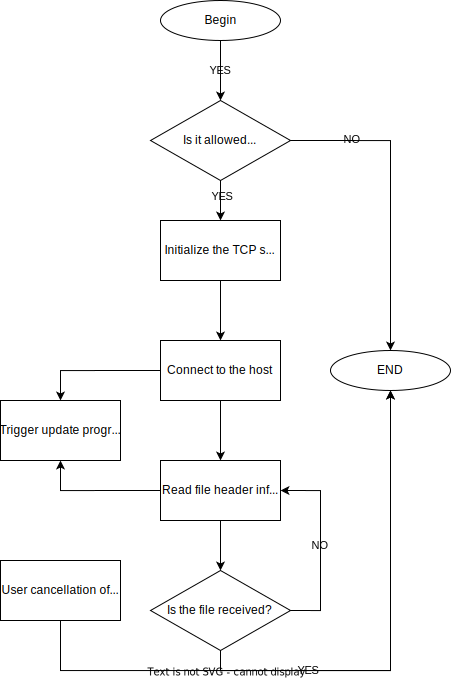

<!-- SPbSTU  -->

    
      
    <b>Санкт-Петербургский государственный политехнический университет</b> 
    <b>Институт компьютерных наук и технологий</b>

<b>PolyChat</b>

<b>Учебный чат</b>

<a href="/doc/README_CN.md">简体中文</a>

<!-- SPbSTU 最后一行 -->

# Содержание

+ [Участники проекта и планирование](#участники-проекта-и-планирование)
+ [Требования](#требования)
  - [Системные требования](#системные-требования)
  - [Технические требования](#технические-требования)
+ [Функциональная спецификация](#функциональная-спецификация)
+ [HLD](#hld)
  - [Дизайн GUI](#дизайн-gui)
    * [Окно авторизации](#окно-авторизации)
    * [Окно списка групповых чатов](#окно-списка-групповых-чатов)
    * [Окно чата](#окно-чата)
  - [Архитектура](#архитектура)
  - [Диаграмма классов](#диаграмма-классов)
  - [Раздел группового чата UDP](#раздел-группового-чата-udp)
    * [Сервер](#сервер)
    * [Клиент](#клиент)
  - [Секция передачи файлов TCP](#секция-передачи-файлов-tcp)
    * [Сторона отправителя](#сторона-отправителя)
    * [Сторона получателя](#сторона-получателя)
  - [Потоки данных](#потоки-данных)

# Участники проекта и планирование

| Участник        | Ответственность                                                                        |
|-----------------|----------------------------------------------------------------------------------------|
| Валерий Фофанов | Внедрить функциональные модули, написать документацию                                  |
| Ли Ицзя         | Внедрить функциональные модули, поддерживать Канбан                                    |
| Мэн Цзянин      | Дизайн формы, построение и организация каркаса кода, реализация функциональных модулей |

# Требования

## Системные требования

Преподавание в Политехническом университете постепенно переходит от онлайнового к оффлайновому обучению. В аудиториях университетов преподаватели часто сталкиваются с проблемами при выдаче заданий или отправке документов студентам. Например, проектор в классе очень нечеткий, студенты на последнем ряду не могут прочитать слова, написанные на доске, преподавателю очень неудобно отправлять документы студентам по учебной сети и часто приходится отвечать на один и тот же вопрос несколько раз для разных студентов.

PolyChat - это кроссплатформенное программное обеспечение для обмена мгновенными сообщениями, предназначенное для решения вышеперечисленных проблем и повышения продуктивности работы преподавателей и студентов. Оно имеет следующие основные характеристики:

- Благодаря закрытому характеру локальной сети, для входа в систему пользователям необходимо указать только свое имя и номер группы, чтобы обеспечить простоту использования и безопасность

- Возможность пользователей быстро создавать групповые чаты и присоединяться к ним, а также отправлять в них сообщения и файлы

- Редактируемое форматирование текстовых сообщений

- Сохранение содержимого сообщения в txt-файл

- Очищение содержимого чата

## Технические требования

Основные технические потребности (требования) следующие:

- Для обеспечения кроссплатформенности разработка будет вестись в Qt

- Чтобы соответствовать философии "высокая сплоченность, низкая связанность", разработка будет вестись с использованием трехуровневой архитектуры, разделяющей уровень представления (UI), уровень бизнес-логики (BLL) и уровень доступа к данным (DAL)

- Qt будет использоваться для кроссплатформенности и масштабируемости

- Для обмена текстовыми сообщениями используется протокол UDP, а для передачи файлов - протокол TCP

- Когда пользователь отправляет сообщение, оно транслируется на порт

- Socket UDP привязывается за фиксированным портом, а сигнал и слот используются для прослушивания входящих данных

# Функциональная спецификация

| Идентификатор                | Требование                                                                                                                                                                                                                                                                                |
|------------------------------|-------------------------------------------------------------------------------------------------------------------------------------------------------------------------------------------------------------------------------------------------------------------------------------------|
| Login_Deficient              | Если имя и/или номер группы не введены, будет выведено уведомление с текстом ошибки                                                                                                                                                                                                       |
| Login_Minimize               | При нажатии на кнопку минимизации окно сворачивается                                                                                                                                                                                                                                      |
| Login_Exit                   | При нажатии на кнопку закрытия происходит выход из основной программы                                                                                                                                                                                                                     |
|                              |                                                                                                                                                                                                                                                                                           |
| DialogList_Load              | При успешном входе пользователя в систему будет вызван список чатов (групповой чат в локальной сети) и загружен соответствующий файл ресурсов                                                                                                                                             |
| DialogList_Add_Chat          | Пользователи могут нажать на кнопку "Плюс", чтобы указать имя группового чата во всплывающем диалоговом окне, и будет создан групповой чат с таким именем. После создания нового группового чата список групповых чатов будет обновлен, чтобы добавить только что созданный групповой чат |
| DialogList_Add_Chat_Clash    | Если групповой чат с определенным именем уже существует, при попытке создать его снова появится уведомление с сообщением об ошибке                                                                                                                                                        |
| DialogList_View              | Пользователи могут использовать колесико мыши для просмотра содержимого списка                                                                                                                                                                                                            |
| DialogList_Select            | Пользователи могут выбрать групповой чат из списка чатов                                                                                                                                                                                                                                  |
| DialogList_Search            | Пользователи могут искать групповой чат по его названию через поисковую строку                                                                                                                                                                                                            |
| DialogList_Join              | При нажатии (выборе) группового чата в списке чатов, пользователь присоединится к групповому чату и появится окно чата                                                                                                                                                                    |
| DialogList_Join_Clash        | Когда пользователь присоединился к групповому чату, при повторном присоединении будет выведено уведомление с текстом ошибки                                                                                                                                                               |
| DialogList_Minimize          | При нажатии на кнопку минимизации окно сворачивается                                                                                                                                                                                                                                      |
| DialogList_Maximize          | При нажатии на кнопку полного экрана окно разворачивается на весь экран                                                                                                                                                                                                                   |
| DialogList_Exit              | При нажатии на кнопку закрытия происходит выход из основной программы                                                                                                                                                                                                                     |
|                              |                                                                                                                                                                                                                                                                                           |
| ChatWidget_Text_Font_Type    | (Выделить текст) Изменить шрифт в раскрывающемся списке. Шрифты, которые можно изменять, - это шрифты, уже установленные на компьютере                                                                                                                                                    |
| ChatWidget_Text_Font_Size    | (Выделить текст) Изменить размер текста в раскрывающемся списке, размер шрифта от 12 до 28                                                                                                                                                                                                |
| ChatWidget_Text_Font_B       | (Выделить текст) Нажатие на кнопку "Жирный" сделает текст жирным                                                                                                                                                                                                                          |
| ChatWidget_Text_Font_I       | (Выделить текст) Нажатие на кнопку "Курсив" сделает текст наклонным                                                                                                                                                                                                                       |
| ChatWidget_Text_Font_L       | (Выделить текст) Нажатие на кнопку "Подчеркивание" добавит подчеркивание в нижнюю часть текста                                                                                                                                                                                            |
| ChatWidget_Mess_View         | Пользователи могут использовать колесико мыши для просмотра журналов чата                                                                                                                                                                                                                 |
| ChatWidget_Mess_Clean        | Нажатие на кнопку "Очистить чат" очистит все журналы чата в своем окне, содержимое окон других пользователей не затрагивается                                                                                                                                                             |
| ChatWidget_Mess_Save         | Нажатие на кнопку "Сохранить" сохранит журнал чата в виде txt-файла                                                                                                                                                                                                                       |
| ChatWidget_Mess_Send         | Нажатие на кнопку "Отправить" отправит текст в поле ввода в групповой чат                                                                                                                                                                                                                 |
| ChatWidget_Mess_Send_Empty   | Когда поле ввода текста пустое, нажатие на кнопку "Отправить" ничего не отправляет                                                                                                                                                                                                        |
| ChatWidget_File_Send         | Пользователи могут выбрать файл и отправить его в групповой чат                                                                                                                                                                                                                           |
| ChatWidget_File_Send_Large   | Если размер файла превышает 1 Гб, он не будет отправлен                                                                                                                                                                                                                                   |
| ChatWidget_File_Receive      | Когда пользователь отправляет файл, другие пользователи могут выбирать, принимать его или нет                                                                                                                                                                                             |
| ChatWidget_File_Receive_Path | Если пользователь решит получить файл, то он может выбрать, где его сохранить                                                                                                                                                                                                             |
| ChatWidget_User_In           | Когда пользователь присоединяется к групповому чату, все пользователи получают сообщение                                                                                                                                                                                                  |
| ChatWidget_User_Out          | Пользователь, нажавший на кнопку выхода, выйдет из группового чата, в то время как другие пользователи не пострадают                                                                                                                                                                      |
| ChatWidget_User_Out_Mess     | Когда пользователь покидает групповой чат, все получают сообщение о том, что пользователь покинул чат                                                                                                                                                                                     |
| ChatWidget_Minimize          | При нажатии кнопки минимизации окно сворачивается                                                                                                                                                                                                                                         |
| ChatWidget_Maximize          | При нажатии на кнопку полного экрана окно разворачивается на весь экран                                                                                                                                                                                                                   |

# HLD

## Дизайн GUI

### Окно авторизации

### Окно списка групповых чатов

### Окно чата

## Архитектура

Мы используем диаграмму Use Case для представления архитектуры программного обеспечения PolyChat:

## Диаграмма классов

В PolyChat существует 3 класса: список групп, группа и пользователь. Их взаимосвязь показана на диаграмме ниже:

## Раздел группового чата UDP и список групп

Это приложение реализует следующую функциональность: в пределах локальной сети пользователи могут добавить (создать) групповой чат, и когда групповой чат создан, список групповых чатов на других хостах синхронизируется и обновляется (через UDP).

После добавления каждого пользователя в групповой чат, в правой части экрана группового чата может быть отображен список онлайн-пользователей, показывающий имя пользователя, номер класса и ip-адрес соответственно. Слева от формы отображается содержание чата, т.е. групповой чат. Каждый человек может ввести текст (и изменить формат текста) и отправить его с экрана ввода чата.

UDP-сообщения передаются по локальной сети с помощью механизма `Broadcast` и для удобства использования дополнены `ShareAddress` и `ReuseAddressHint`, которые описаны ниже.

- `Broadcast`: широковещательная передача на все порты текущей локальной сети

- `ShareAddress`: позволяет другим службам связываться с тем же адресом и портом. Это полезно, когда несколько процессов разделяют нагрузку на службу, прослушивая один и тот же адрес и порт (например, веб-сервер с несколькими предварительно вилочными слушателями может значительно улучшить время отклика). Однако, поскольку любой службе разрешено перепривязываться, этот вариант должен учитывать некоторые вопросы безопасности. Поэтому, комбинируя эту опцию с `ReuseAddressHint`.

- `ReuseAddressHint`: он должен попытаться перепривязать сервис, даже если адрес и порт уже привязаны другим сокетом.

### Собственный протокол взаимодействия UDP

Для достижения вышеуказанной функциональности и обеспечения последующей расширяемости программы. Используется индивидуальный протокол связи, в котором 8 блоков.

- `Блок 1`: типы сообщений. В настоящее время существует 6 типов.
    - `ChatExist`: текущее окно группового чата существует и транслируется через регулярные промежутки времени
    - `ChatDestory`: удаляет текущий групповой чат, отправляется, когда все (последние) участники группового чата покинули его.
    - `Msg`: обычное текстовое сообщение
    - `File`: запрос на отправку файла
    - `UserJoin`: пользователь присоединяется к текущему групповому чату
    - `UserLeft`: пользователь покидает текущий групповой чат

- `Блок 2`: название текущего группового чата
- `Блок 3`: порт, на котором находится текущий групповой чат
- `Блок 4`: имя пользователя, отправившего это сообщение
- `Блок 5`: группы пользователя, отправившего это сообщение
- `Блок 6`: IP-адрес пользователя, отправившего это сообщение
- `Блок 7`: содержание сообщения (переменной длины)
- `Блок 8`: содержание сообщения (переменной длины, используется для расширения параграфа 7)

Как показано на диаграмме ниже:

### Сервер

> **Примечание: Система чата в PolyChat похожа на P2P, в том смысле, что пользователь может выступать как в роли сервера, так и в роли клиента. Один пользователь может выступать в качестве и сервера, и клиента. **

После создания UDP-сокета и привязки его к фиксированному порту, сервер отслеживает входящие данные, используя сигналы и слоты. Если появляетя сообщение, он получает данные и анализирует тип сообщения. Если сообщение является входом нового пользователя, сервер обновляет список пользователей и добавляет уведомление о новом пользователе онлайн в окно отображения чата; аналогично, если пользователь находится в автономном режиме, сервер удаляет пользователя из списка пользователей и отображает уведомление об автономном режиме в окне отображения чата; если это сообщение чата, он получает сообщение и отображает его в окне. Технологическая схема выглядит следующим образом.

### Клиент

> **Примечание: Система чата в PolyChat похожа на P2P, в том смысле, что пользователь может выступать как в роли сервера, так и в роли клиента. Один пользователь может выступать в качестве и сервера, и клиента. **

Когда пользователь присоединяется к групповому чату, имя пользователя, номер группы, имя хоста и ip-адрес получаются и передаются на LAN-сервер (ChatBoxWidget) для обновления списка пользователей справа. Затем, когда клиенту нужно отправить сообщение, он вводит его в поле ввода чата и нажимает кнопку отправки, чтобы отправить чат, одновременно транслируя различные сообщения из локальной системы. Технологическая схема выглядит следующим образом：

## Секция передачи файлов TCP

### Собственный протокол взаимодействия TCP

TCP использует специализированный протокол связи, в котором есть 4 части.

Части с 1 по 3 - это заголовки файлов, а часть 4 - собственно данные.

- `Часть 1`: Имя файла
- `Часть 2`: размер файла (байт)
- `Часть 3`: MD5 файла
- `Часть 4`: данные (4 Кб на блок)

При передаче сервер сначала отправляет заголовок файла. Для предотвращения "липких" пакетов TCP, подождите 20 мс перед началом отправки блока данных

### Сторона отправителя

> ***Сторона отправателя берет на себя роль сервера.***

Нажмите на кнопку Отправить, выберите файл для отправки на локальном компьютере, нажмите на кнопку Отправить, появится экран Отправителя, затем индикатор выполнения покажет информацию о файле, который в данный момент отправляется, ход передачи, подключенного в данный момент клиента и другую информацию. Если вы хотите закрыть процесс отправки, нажмите кнопку Закрыть. Технологическая схема выглядит следующим образом:

### Сторона получателя

> ***Сторона получателя берет на себя роль клиента.***

В интерфейсе появится диалоговое окно с вопросом, хотите ли вы принять сообщение о передаче файла от конкретного пользователя, если да, нажмите кнопку Yes, в противном случае нажмите кнопку No.

После того, как вы выбрали каталог и имя файла, в котором вы хотите получить файл, вы начнете получать файл, в процессе также будет отображаться ход передачи файла, информация о получателе и клиенте. Интерфейс на принимающей стороне показан ниже:

Технологическая схема выглядит следующим образом:

## Потоки данных

Мы используем диаграмму потоков данных для представления обработки сообщений, полученных в окне группового чата PolyChat:

