 <p align="center"><b><font size=18>PolyChat</font></b></p>
 <p align="center"><b>QT-based cross-platform LAN chat room</b></p>

 <p align="center"></p>

<p align="center">
    <a href="./doc/README_RU.md">Руский язык</a>
    <a href="./doc/README_CN.md">简体中文</a>
</p>


<div align=left>


<div align=center>

[](LICENSE)

[](https://github.com/NekoSilverFox/PolyChat/actions/workflows/macos.yml)
[](https://github.com/NekoSilverFox/PolyChat/actions/workflows/windows.yml)

</div>


[toc]

# Requirements

## System Requirements

Currently, teaching at the University of Science and Technology is gradually transitioning from online to offline mode. However, in the classrooms, teachers often encounter various issues when assigning tasks to students or sending files. These issues include a very unclear projector in the classroom, students in the back rows struggling to see what's written on the blackboard, the inconvenience of teachers sending files to students within the school's network environment, and the need for teachers to repeatedly answer the same questions from different students.

PolyChat is a cross-platform instant messaging software designed to address the above problems and improve the efficiency of both teachers and students. It has the following key features:

- Thanks to the closed nature of the local network for usability and security, users only need to provide their name and class number to log in and use the application.
- Users can quickly create and join group chats and send messages and files within them.
- Editable text message formatting.
- Save message content as files.
- Clear chat content.

## Technical Requirements

There are several main technical requirements:

- To ensure cross-platform compatibility, development will be done using Qt.
- To adhere to the principle of "high cohesion, low coupling," a three-tier architecture will be used, separating the presentation layer (UI), business logic layer (BLL), and data access layer (DAL).
- To achieve cross-platform and scalability, Qt will be used for development.
- Text message delivery will use the UDP protocol, while file transmission will use the TCP protocol.
- When a user sends a message, it will be broadcast on a specific port.
- A UDP socket will be bound to a fixed port to listen for incoming data using the signal-slot mechanism.
- GitHub platform's Actions will be used to implement CI/CD, allowing for automatic testing, building, packaging, and deployment.


# Functional Specifications

| Identifier                   | Explanation                                                  |
| ---------------------------- | ------------------------------------------------------------ |
| Login_Deficient              | If either the name or class number is not entered, a notification will be displayed, including an error message. |
| Login_Minimize               | When the minimize button is clicked, the window will be minimized. |
| Login_Maximize               | When the close button is clicked, the main program exits.    |
|                              |                                                              |
| DialogList_Load              | After successful login, the dialog list (group chats in the local network) will be called, and the corresponding resource files will be loaded. |
| DialogList_Add_Chat          | Users can click the plus button to specify a group chat name through a pop-up dialog, and a group chat with that name will be created. After creating a new group chat, the chat list will be refreshed to include the newly created chat. |
| DialogList_Add_Chat_Clash    | When a chat with a particular name already exists, attempting to create it again will display a notification, including an error message. |
| DialogList_View              | Users can use the mouse scroll wheel to view the contents of the list. |
| DialogList_Select            | Users can select a specific group chat in the dialog list.   |
| DialogList_Search            | Users can search for a group chat by name using the search box. |
| DialogList_Join              | When a group chat in the dialog list is clicked (selected), the user will join the chat, and a chat window will pop up. |
| DialogList_Join_Clash        | If a user has already joined a particular group chat and attempts to join it again, a notification will be displayed, including an error message. |
| DialogList_Minimize          | When the minimize button is clicked, the window will be minimized. |
| DialogList_Maximize          | When the full-screen button is clicked, the window will fill the entire screen. |
| DialogList_Exit              | Pressing the close button exits the main program.            |
|                              |                                                              |
| ChatWidget_Text_Font_Type    | (Selecting a portion of text) Users can modify the font from a dropdown list, selecting from fonts already installed on the computer. |
| ChatWidget_Text_Font_Size    | (Selecting a portion of text) Users can change the font size from a dropdown list, with sizes ranging from 12 to 28. |
| ChatWidget_Text_Font_B       | (Selecting a portion of text) Clicking the bold button will make the text bold. |
| ChatWidget_Text_Font_I       | (Selecting a portion of text) Clicking the italic button will make the text italic. |
| ChatWidget_Text_Font_L       | (Selecting a portion of text) Clicking the underline button will add an underline at the bottom of the text. |
| ChatWidget_Mess_View         | Users can use the mouse scroll wheel to view chat records.   |
| ChatWidget_Mess_Clean        | Clicking the clear chat records button will clear all chat records within the user's window, without affecting the content in other users' windows. |
| ChatWidget_Mess_Save         | Clicking the save button will save chat records as a txt file. |
| ChatWidget_Mess_Send         | Clicking the send button will send the text content from the input box to the group chat. |
| ChatWidget_Mess_Send_Empty   | When the text input box is empty, clicking the send button will not send any content. |
| ChatWidget_File_Send         | Users can select a file and send it to the group chat.       |
| ChatWidget_File_Send_Large   | Files larger than 1GB cannot be sent.                        |
| ChatWidget_File_Receive      | After a user sends a file, other users can choose whether to accept the file. |
| ChatWidget_File_Receive_Path | If a user chooses to receive a file, they can specify the file's save location. |
| ChatWidget_User_In           | When a user joins a group chat, all users will receive a message. |
| ChatWidget_User_Out          | When a user clicks the exit button, they leave the group chat, and other users are not affected. |
| ChatWidget_User_Out_Mess     | When a user leaves the group chat, everyone will receive a message indicating that the user has exited. |
| ChatWidget_Minimize          | When the minimize button is clicked, the window will be minimized. |
| ChatWidget_Maximize          | When the full-screen button is clicked, the window will fill the entire screen. |

# HLD


## User Interface Design

### Login



### User List Interface


### Chat Widget


## Software Architecture

We use use case diagrams to illustrate the software architecture of PolyChat:



## Class Diagram

In PolyChat, there are three main classes: Chat List, Chat Group, and User. Their relationships are shown in the following diagram:


## UDP Group Chat and Chat List

The functionality implemented in this program allows users to add (create) a group chat within a local area network. When a group chat is created, the chat lists on other hosts should be synchronized and updated (using UDP).

Once a user joins a group chat, the right side of the chat interface displays a list of online users, showing their usernames, class numbers, and IP addresses. On the left side is the chat content display area, which is the group chat itself. Each user can input text in the chat input interface (and also modify text formatting) and send messages.

UDP messages are broadcast within the local area network using the `Broadcast` mechanism. The software uses `ShareAddress` and `ReuseAddressHint` to enhance usability. Here's an explanation of these:

- `Broadcast`: Broadcasts messages to all ports within the current local network.
- `ShareAddress`: Allows other services to bind to the same address and port. This is useful when multiple processes listen to the same address and port to distribute the load of a service (e.g., a web server with multiple pre-forked listeners can significantly improve response times). However, this option needs to be considered for certain security issues, which is why it's used in combination with `ReuseAddressHint`.
- `ReuseAddressHint`: Even if the address and port are already bound by another socket, it should attempt to rebind the service.

These features allow users within the local network to communicate through group chats and ensure that the chat lists on different hosts stay up-to-date through UDP broadcasting.


## UDP Communication Protocol

To implement the aforementioned features and ensure the software's future extensibility, a custom communication protocol is used. This protocol consists of 8 blocks:

- `Block 1`: Message type. Currently, there are 6 types:
    - `ChatExist`: Indicates the current existence of the group chat window, broadcasted periodically.
    - `ChatDestory`: Used to delete the current group chat when all users leave it (when the last user exits).
    - `Msg`: For regular text messages.
    - `File`: Used for file transfer requests.
    - `UserJoin`: Sent when a user joins the current group chat.
    - `UserLeft`: Sent when a user leaves the current group chat.

- `Block 2`: Name of the current group chat.
- `Block 3`: Port where the current group chat is located.
- `Block 4`: Username of the message sender.
- `Block 5`: Class number of the user sending the message.
- `Block 6`: IP address of the user sending the message.
- `Block 7`: Message content (variable length).
- `Block 8`: Message content (variable length, for extending Block 7).

Here's a graphical representation:


###  Server

**Note: In the PolyChat chat system, it operates similarly to P2P. A user can act as both a server and a client.**

To implement this, a UDP socket is created and bound to a fixed port. It listens for incoming data using signals and slots. When data arrives, it is received, and the message type is analyzed. If the message indicates a new user login, the server updates the user list and adds a notification about the new user going online to the chat display window. Similarly, if it's a user logout message, the server removes that user from the user list and displays an offline notification in the chat window. If it's a chat message, the server receives the message and displays it in the chat window.

Here's a flowchart to illustrate the process:


###  Client

**Note: In the PolyChat chat system, it operates similarly to P2P. A user can act as both a server and a client.**

Firstly, when a user joins a group chat, their username, class number, hostname, and IP address are obtained. These details are then broadcasted to the local area network's server (ChatBoxWidget) to update the user list on the right side of the chat interface. When the client needs to send a message, they input the message in the chat input bar and press the send key. At the same time, various local system information is also broadcasted. Here's a flowchart illustrating the process:


##  TCP File Transfer Section

### TCP Communication Protocol

TCP uses a custom communication protocol consisting of four parts:

Parts 1-3 make up the file header, while Part 4 contains the actual data.

- `Part 1`: File name
- `Part 2`: File size (in bytes)
- `Part 3`: MD5 hash of the file
- `Part 4`: Data (each data block is 4KB in size)

During transmission, the server first sends the file header. To prevent TCP packet sticking, it waits for 20ms before starting to send data blocks.


###  Sender

The sender acts as the server, responsible for sending files.


Clicking the "File Send" button allows you to select the file you want to send from your local computer. When you click the "Send" button, a sender interface pops up. On this interface, a progress bar displays the current file transfer information, including the size of the file sent and the transfer speed. If you want to terminate the sending process, you can simply click the "Close" button. Here's a flowchart illustrating the process:


###  Receiver

**The receiver acts as the client in this operation.**

When a file transfer request is received, a dialog box is displayed in the interface asking whether to accept the file transfer from a specific user. If the user chooses to accept, they click the "Yes" button; otherwise, they click the "No" button.


When receiving a file, after choosing the directory and file name for the received file, the process begins, displaying the progress of the file transfer. The receiver's interface would resemble the one shown in the diagram below:


Here's a flowchart illustrating the process of receiving a file:


## Data flow

Data flow diagrams are used to represent the information receiving and processing process in the PolyChat group chat window:


# Test

> Due to GitHub no longer supporting MacOS 10.15 and clang_64, the CI (Continuous Integration) for MacOS has been updated to MacOS 11.0.

## Explanation

Testing of PolyChat will be conducted using QTest. QTestlib is a unit testing framework provided by Qt for testing programs or libraries written using Qt. QTestlib offers basic unit testing capabilities and extends its functionality for GUI testing. Some of QTestlib's features include:

A. Lightweight: QTestlib consists of only 6000 lines of code and 60 exported symbols.
B. Self-contained: For non-GUI testing, QTestlib requires only a few symbols from the Qt core library.
C. Quick Testing: QTestlib doesn't require a special test runner, and tests don't need special registration.
D. Data-Driven Testing: A test program can be executed multiple times with different sets of test data.
E. Basic GUI Testing: QTestlib provides features to simulate mouse and keyboard events.
F. Benchmark Testing: QTestlib supports benchmark testing and offers multiple measurement backends.
G. IDE Friendly: QTestlib's output can be parsed by Visual Studio and KDevelop.
H. Thread-Safe: Error reporting is thread-safe and atomic.
J. Type-Safe: It extends template usage to prevent errors caused by implicit type conversions.
K. Extensible: Users can easily add custom types to test data and test output.

Testing must be automated and performed when building the project with the qmake build system that generates the executable. GitHub uses CI/CD, and triggers automatically build and test on both Windows and macOS platforms when code changes occur (testing on both platforms ensures PolyChat's cross-platform compatibility).

## Expanding Test Suites

When new code is added, the test suite should be expanded by adding new test cases with the following attributes:

- Test name (identifier) that includes the test level, related module, and the test subject.
- Related modules impacted by the test.
- Descriptions of the expected results and the application's response to them.

If new code also changes the software's behavior, all test cases related to affected product modules should be reviewed and rewritten to match the new behavior.

## Unit (Module) Testing

Several testing design techniques are applied:

- Equivalent Class

    ```c++
    void PolyChatTester::ut_login_login_empty()
    {
        bool isSuccInitLocalUser = DAL::initLocalUser("", "3530904/90102");
        QCOMPARE(isSuccInitLocalUser, false);
    }
    ```

- Boundary Conditions

    ```c++
    void PolyChatTester::ut_chatbox_cbxFontSize_min_max()
    {
        ChatBoxWidget chatBox(nullptr, "3530409/90102", 2333);
        QComboBox* cbox = chatBox.findChild<QComboBox*>("cbxFontSize");
        qDebug() << " cbox->count();" << cbox->count();
        QCOMPARE(cbox->itemText(0).toInt(), 10);
        QCOMPARE(cbox->itemText(cbox->count() - 1).toInt(), 28);
    }
    ```

- Pairwise Testing

    ```c++
    void PolyChatTester::ut_chatbox_btnBold()
    {
        ChatBoxWidget chatBox(nullptr, "3530409/90102", 2333);
        QToolButton* button = chatBox.findChild<QToolButton*>("btnBold");
    
        QCOMPARE(button->isCheckable(), true);
        QCOMPARE(button->toolButtonStyle(), Qt::ToolButtonStyle::ToolButtonIconOnly);
    }
    ```

This table outlines the test cases for PolyChat, including test names, the associated modules, and the expected outcomes:

| Test Case | Test Name                   | Module      | Description (Expected Results)                                 |
|-----------|-----------------------------|-------------|-----------------------------------------------------------------|
| 1         | ut_login_login_empty        | Login       | Login fails (username cannot be empty)                        |
| 2         | ut_login_group_empty        | Login       | Login fails (class number cannot be empty)                    |
| 3         | ut_login_login_group_empty  | Login       | Login fails (both username and class number cannot be empty)   |
| 4         | ut_login_init_login         | Login       | Initialize local information with the correct format of login  |
| 5         | ut_login_init_group         | Login       | Initialize local information with the correct format of class number |
| 6         | ut_login_btnlogin           | Login       | Ensure btnlogin is non-checkable, and the icon display is disabled |
| 7         | ut_login_btnlogin_emit      | Login       | Ensure the signal is correctly triggered every time the user clicks the login button |
| 8         | ut_login_btnInfo_emit       | Login       | Ensure the signal is correctly triggered every time the user clicks the btnInfo button |
| 9         | ut_login_window             | Login       | The Login window is not resizable and has a size of 400x250    |
| 10        | ut_addchat_btnCancelAddChat  | Add Chat    | Ensure that btnCancelAddChat is a clickable button, and the text display is disabled |
| 11        | ut_addchat_btnAddChat        | Add Chat    | Ensure that btnAddChat is a clickable button, and the text display is disabled |
| 12        | ut_chat_init                | Chat(Class) | Correctly initialize a Chat object using the constructor       |
| 13        | ut_chatlist_init            | ChatList    | Correctly initialize a ChatList object using the constructor   |
| 14        | ut_chatlist_btnNewChat      | ChatList    | Ensure that btnNewChat is a checkable QToolButton, and the text display is disabled |
| 15        | ut_chatlist_btnNewChat_emit | ChatList    | Ensure that the signal is correctly triggered every time the user clicks the "Add Chat" button |
| 16        | ut_chatlist_leSearch        | ChatList    | Simulate user input by clicking and typing on the keyboard to ensure input content is correctly displayed in leSearch |
| 17        | ut_chatlist_lbName          | ChatList    | Correctly display the user's username in lbName                |
| 18        | ut_chatlist_lbGroupNumber   | ChatList    | Correctly display the user's class number in lbGroupNumber      |
| 19        | ut_chatlist_lbIP            | ChatList    | Correctly display the user's IP address in lbIP                |
| 20        | ut_addchat_port_exist       | ChatList    | Returns true (a group chat already exists on the current port) |
| 21        | ut_addchat_port_not_exist   | ChatList    | Returns false (no group chat exists on the current port)       |
| 22        | ut_addchat_chat_exist       | ChatList    | Returns true (a group chat with the same name already exists)  |
| 23        | ut_addchat_chat_not_exist   | ChatList    | Returns false (no group chat with the same name exists)        |
| 24        | ut_chatlist_chat_not_open   | ChatList    | Returns true (a group chat with a certain name is not open)    |
| 25        | ut_chatlist_chat_open       | ChatList    | Returns false (a group chat with a certain name is open)       |
| 26        | mt_chatlist_getRandomPort   | ChatList    | Generates a random port between PORT_MIN and PORT_MAX           |
| 27        | mt_chatlist_setChatState    | ChatList    | Set the chat window to open or close normally                  |
| 28        | ut_tcpclient_lbClientIP     | TcpClient   | lbClientIP content is correctly parsed and displayed           |
| 29        | ut_tcpclient_lbClientPort   | TcpClient   | lbClientPort content is correctly parsed and displayed         |
| 30        | ut_tcpclient_lbServerIP     | TcpClient   | lbServerIP content is correctly parsed and displayed           |
| 31        | ut_tcpclient_lbServerPort   | TcpClient   | lbServerPort content is correctly parsed and displayed         |
| 32        | ut_tcpclient_lbFileName     | TcpClient   | lbFileName content is correctly parsed and displayed           |
| 33        | ut_tcpclient_lbFileSize     | TcpClient   | lbFileSize content is correctly parsed and displayed           |
| 34        | ut_tcpclient_progressBar    | TcpClient   | progressBar is initialized to 0                                |
| 35        | ut_tcpclient_btnCancel      | TcpClient   | Ensure that btnCancel is non-checkable                           |
| 36        | ut_tcpclient_btnCancel_emit | TcpClient   | Ensure that the signal is correctly triggered every time the user clicks the Cancel button |
| 37        | ut_tcpclient_btnSave        | TcpClient   | Ensure that btnSave is non-checkable                            |
| 38        | ut_tcpclient_btnSave_emit   | TcpClient   | Ensure that the signal is correctly triggered every time the user clicks the Save button |
| 39        | ut_tcpclient_closeEvent_emit | TcpClient   | Triggered when the user closes the window |
| 40        | ut_tcpclient_textBrowser    | TcpClient   | textBrowser is in read-only mode and does not allow writing   |
| 41        | ut_tcpserver_lbClientIP     | TcpServer   | lbClientIP content is correctly parsed and displayed           |
| 42        | ut_tcpserver_lbClientPort   | TcpServer   | lbClientPort content is correctly parsed and displayed         |
| 43        | ut_tcpserver_lbServerIP     | TcpServer   | lbServerIP content is correctly parsed and displayed           |
| 44        | ut_tcpserver_lbServerPort   | TcpServer   | lbServerPort content is correctly parsed and displayed         |
| 45        | ut_tcpserver_lbFilePath     | TcpServer   | lbFilePath content is correctly parsed and displayed           |
| 46        | ut_tcpserver_lbFileSize     | TcpServer   | lbFileSize content is correctly parsed and displayed           |
| 47        | ut_tcpserver_btnCancel      | TcpServer   | Ensure that btnCancel is non-checkable                           |
| 48        | ut_tcpserver_btnCancel_emit | TcpServer   | Ensure that the signal is correctly triggered every time the user clicks the Cancel button |
| 49        | ut_tcpserver_progressBar    | TcpServer   | progressBar is initialized to 0                                |
| 50        | ut_tcpserver_closeEvent_emit | TcpServer   | Triggered when the user closes the window |
| 51        | ut_tcpserver_textBrowser    | TcpServer   | textBrowser is in read-only mode and does not allow writing   |
| 52        | ut_chatbox_title            | ChatBox     | The title of the ChatBox window is correctly initialized (complies with the format) |
| 53        | ut_chatbox_btnBold          | ChatBox     | Ensure that btnBold is a checkable QToolButton, and the text display is disabled |
| 54        | ut_chatbox_btnItalic        | ChatBox     | Ensure that btnItalic is a checkable QToolButton, and the text display is disabled |
| 55        | ut_chatbox_btnUnderLine     | ChatBox     | Ensure that btnUnderLine is a checkable QToolButton, and the text display is disabled |
| 56        | ut_chatbox_btnColor         | ChatBox     | Ensure that btnColor is not a checkable QToolButton, and the text display is disabled |
| 57        | ut_chatbox_btnFileSend      | ChatBox     | Ensure that btnFileSend is not a checkable QToolButton, and the text display is disabled |
| 58        | ut_chatbox_btnSave          | ChatBox     | Ensure that btnSave is not a checkable QToolButton, and the text display is disabled |
| 59        | ut_chatbox_btnClean         | ChatBox     | Ensure that btnClean is not a checkable QToolButton, and the text display is disabled |
| 60        | ut_chatbox_btnExit          | ChatBox     | Ensure that btnExit is not checkable                            |
| 61        | ut_chatbox_btnSend          | ChatBox     | Ensure that btnSend is not checkable                            |
| 62        | ut_chatbox_btnBold_emit     | ChatBox     | Clicking btnBold triggers a signal, and the state changes to enabled; clicking again restores the initial state |
| 63        | ut_chatbox_btnItalic_emit   | ChatBox     | Clicking btnItalic triggers a signal, and the state changes to enabled; clicking again restores the initial state |
| 64        | ut_chatbox_btnUnderLine_emit | ChatBox     | Clicking btnUnderLine triggers a signal, and the state changes to enabled; clicking again restores the initial state |
| 65        | ut_chatbox_btnColor_emit     | ChatBox     | Clicking btnColor triggers a signal                           |
| 66        | ut_chatbox_btnFileSend_emit  | ChatBox     | Clicking btnFileSend triggers a signal                        |
| 67        | ut_chatbox_btnSave_emit      | ChatBox     | Clicking btnSave triggers a signal                            |
| 68        | ut_chatbox_btnClean_emit     | ChatBox     | Clicking btnClean triggers a signal                           |
| 69        | ut_chatbox_btnExit_emit      | ChatBox     | Clicking btnExit triggers a signal                            |
| 70        | ut_chatbox_btnSend_emit      | ChatBox     | Clicking btnSend triggers a signal                            |
| 71        | ut_chatbox_msgTextBrowser   | ChatBox     | msgTextBrowser is read-only                                    |
| 72        | ut_chatbox_msgTextEdit      | ChatBox     | msgTextEdit allows writing                                    |
| 73        | ut_chatbox_init_cbxFontSize | ChatBox     | Initial font size is 12                                        |
| 74        | ut_chatbox_cbxFontSize_min_max | ChatBox | Minimum font size is 10, maximum is 28                        |
| 75        | ut_chatbox_closeEvent_emit | ChatBox     | Triggered when the user closes the window                     |
| 76        | ut_chatbox_tbUser          | ChatBox     | The width of the user list is between 150-350                  |
| 77        | ut_chatbox_lbNumberOnlineUse | ChatBox     | The UI for online users is initialized in the correct format  |

These tests are designed to ensure that PolyChat operates as expected and complies with the specified requirements.

## Integration (Interface) Testing

Integration testing has been performed on the following modules: Login, Add Chat, ChatList, ChatBox, TcpClient, and TcpServer. These tests were conducted in Qt by initializing (calling) individual windows to isolate the external environment and eliminate potential impacts from other windows. In some of these tests, we also simulated user keyboard input to reflect real-world user scenarios.

Several testing design techniques were applied:

- Equivalence Classes

    ```c++
    void PolyChatTester::mt_chatlist_leSearch_change_emit()
    {
        DAL::initLocalUser("Fox", "3530904/90102");
        ChatList widget(nullptr, DAL::getLocalUserName(), DAL::getLocalUserGroupNumber(), DAL::getLocalIpAddress());
        QLineEdit* lineEdit = widget findChild<QLineEdit*>("leSearch");
    
        QSignalSpy spy(lineEdit, &QLineEdit::textEdited);
        QTest::keyClicks(lineEdit, "90111");
        QCOMPARE(spy.count(), 5);
    }
    ```

- Boundary Conditions

    ```c++
    bool PolyChatTester::mt_chatlist_getRandomPort()
    {
        ChatList widget(nullptr, DAL::getLocalUserName(), DAL::getLocalUserGroupNumber(), DAL::getLocalIpAddress());
        for (int i = 0; i < PORT_MAX - PORT_MIN; i++)
        {
            qint16 port = widget.getRandomPort();
            if (port > PORT_MAX || port < PORT_MIN) return false;
        }
        return true;
    }
    ```

- Pairwise Testing

```c++
void PolyChatTester::mt_chatbox_save_empty()
{
    QTimer* timer = new QTimer(this);
    connect(timer, &QTimer::timeout, this, [=](){
        QWidgetList topWidgets = QApplication::topLevelWidgets();
        foreach (QWidget *w, topWidgets) {
            if (QMessageBox *mb = qobject_cast<QMessageBox *>(w)) {
                QTest::keyClick(mb, Qt::Key_Enter);
            } else if (QFileDialog* dialog = qobject_cast<QFileDialog *>(w)) {
                QTest::keyClick(dialog, Qt::Key_Cancel);
            } else if (QColorDialog* dialog = qobject_cast<QColorDialog *>(w)) {
                QTest::keyClick(dialog, Qt::Key_Enter);
            } else {
                w->close();
            }
        }
    });
  
    timer->start(50);
    ChatBoxWidget chatBox(nullptr, "3530409/90102", 2333);

    QTextBrowser* msgTextBrowser = chatBox.findChild<QTextBrowser*>("msgTextBrowser");
    QCOMPARE(msgTextBrowser->toPlainText(), "");


    QToolButton* button = chatBox.findChild<QToolButton*>("btnSave");
    QTest::mouseClick(button, Qt::LeftButton);
    timer->stop();
}
```

**Tests:**

|      | Test Name                          | Module    | Description (Expected Result)                                |
| ---- | ---------------------------------- | --------- | ------------------------------------------------------------ |
| 78   | mt_login_init_succ                 | Login     | Simulate the user to input content in the input boxes using the keyboard, then click the login button (Login successful, local user information is correctly initialized) |
| 79   | mt_login_leUserName                | Login     | Simulate user clicking and inputting through the keyboard to ensure that the input content is correctly displayed in the leUserName input box |
| 80   | mt_login_leUserGroupNumber         | Login     | Simulate user clicking and inputting through the keyboard to ensure that the input content is correctly displayed in the leUserGroupNumber input box |
| 81   | mt_addchat_leNameNewChat           | Add Chat  | Simulate user clicking and inputting through the keyboard to ensure that the input content is correctly displayed in the leNameNewChat input box |
| 82   | mt_chatlist_leSearch_change_emit   | ChatList  | When the user changes the content in the search box, trigger the correct number of signals |
| 83   | mt_chatlist_getNewBtn              | ChatList  | Create a new button object with the correct information based on the passed parameters |
| 84   |                                    |           |                                                              |
| 85   |                                    |           |                                                              |
| 86   | mt_chatlist_btnchat_exist          | ChatList  | When adding a new chat group, the UI is correctly refreshed  |
| 87   | mt_chatbox_userjoin_list           | ChatBox   | User join (user list is correctly refreshed)                 |
| 88   | mt_chatbox_userjoin_counter        | ChatBox   | User join (counter is correctly increased, and the UI display format and content are correct) |
| 89   | mt_chatbox_userjoin_msgTextBrowser | ChatBox   | User join (msgTextBrowser is refreshed)                      |
| 90   | mt_chatbox_userleft_list           | ChatBox   | User leave (user list is correctly refreshed)                |
| 91   | mt_chatbox_userleft_conter         | ChatBox   | User leave (counter is correctly increased, and the UI display format and content are correct) |
| 92   | mt_chatbox_userleft_msgTextBrowser | ChatBox   | User leave (msgTextBrowser is refreshed)                     |
| 93   | mt_chatbox_clean                   | ChatBox   | When clearing the chat box, a warning message is displayed   |
| 94   | mt_chatbox_save_empty              | ChatBox   | When there is no content in the chat box, simulate the user clicking the "Save Chat Record" button (display a warning message) |
| 95   | mt_chatbox_send_success            | ChatBox   | Simulate the user to input content in the chat box using the keyboard and then click the send button. The entered information is correctly displayed in the message box (message sent successfully) |
| 96   | mt_tcpclient                       | TcpClient | All controls on the UI interface are initialized with correct content |
| 97   | mt_tcpserver                       | TcpServer | All controls on the UI interface are initialized with correct content |

**Integration Testing Results:**


## System/End-to-End and Other Tests

*For more information about continuous integration and setting up triggers in GitHub, please see the Integration Testing section below.*

| Test | Description                                                  |
| ---- | ------------------------------------------------------------ |
| 96   | 1. User opens the program<br />2. User clicks on the username input box and inputs text using the keyboard<br />3. User clicks on the group number input box and inputs text using the keyboard<br />4. User clicks the login button<br />5. User clicks the "Add New Group Chat" button<br />6. User enters text in the "Add Chat" dialog that appears<br />7. User clicks the "Confirm" button to add a new group chat |
| 97   | 1-4. User is already logged in<br />5. User clicks on a chat button in the chat list |
| 98   | 1-4. User is already logged in<br />5. User clicks on the chat search bar and inputs a name using the keyboard<br />6. User clicks on a chat button in the list of found chats |
| 99   | 1-4. User is already logged in<br />5. User clicks on a chat button in the chat list<br />6. User clicks in the chat area and inputs text using the keyboard<br />7. User clicks the "Send" button |
| 100  | 1-4. User is already logged in<br />5. User clicks on a chat button in the chat list<br />6. User clicks in the chat area and inputs text using the keyboard<br />7. User clicks on text formatting buttons (bold, italic, etc.)<br />8. User clicks the send button |
| 101  | 1-4. User is already logged in<br />5. User clicks on a chat button in the chat list<br />6. User clicks the send file button<br />7. User selects a file to send<br />8. User clicks the send button |
| 102  | 1-4. User is already logged in<br />5. User clicks on a chat button in the chat list<br />6. When prompted if they want to accept the file, the user clicks "Yes"<br />7. User selects a directory and filename for the received file<br />8. User clicks the save button |
| 103  | 1-4. User is already logged in<br />5. User clicks on a chat button in the chat list<br />6. User clicks the "Clear Chat" button |
| 104  | 1-4. User is already logged in<br />5. User clicks on a chat button in the chat list<br />6. User clicks the "Save Chat" button |
| 105  | 1-4. User is already logged in<br />5. User clicks on a chat button in the chat list<br />6. User clicks in the chat area, inputs text using the keyboard<br />7. User clicks the send button<br />8. Another user joins the group chat<br />9. Another user leaves the group chat<br />10. User clicks the "Leave Chat" button |

**GitHub Results:**


## Other Tests

|      | Test Name                    | Type                                 | Module           | Description (Expected Results)                               |
| ---- | ---------------------------- | ------------------------------------ | ---------------- | ------------------------------------------------------------ |
| 106  | pt_Login_load                | Performance Test                     | Login            | Performance of window loading/calling                        |
| 107  | pt_AddChat_load              | Performance Test                     | Add Chat         | Performance of window loading/calling                        |
| 108  | pt_ChatList_load             | Performance Test                     | ChatList         | Performance of window loading/calling                        |
| 109  | pt_TcpClient_load            | Performance Test                     | TcpClient        | Performance of window loading/calling                        |
| 110  | pt_TcpServer_load            | Performance Test                     | ChatBox          | Performance of window loading/calling                        |
| 111  | pt_ChatBox_load              | Performance Test                     | ChatBox          | Performance of window loading/calling                        |
| 112  | pt_ChatBox_userjoin          | Performance Test                     | ChatBox          | User joins group chat                                        |
| 113  | pt_ChatBox_userjoin_left     | Performance Test                     | ChatBox          | User joins group chat with others leaving                    |
| 114  | pt_ChatBox_msgTextEdit_input | Performance Test                     | ChatBox          | Simulate user keyboard input of 100 characters in msgTextEdit and click the send button |
| 115  | pt_Login_to_system           | Performance Test                     | Login/ChatList   | User enters the system (ChatList) by typing name and class number via keyboard and clicking login button |
| 116  | pt_AddChat_ui                | Performance Test                     | Add Chat/ChatBox | Add a new chat via Add Chat by simulating user input and clicking the confirm button (Test the performance of creating a new chat window) |
| 117  | lt_ChatBox_x100              | Load Test                            | ChatBox          | User joins 100 group chats                                   |
| 118  | lt_ChatBox_200user           | Load Test                            | ChatBox          | Ensure 200 users can exist in each chat                      |
| 119  | lt_ChatBox_2000char          | Load Test                            | ChatBox          | User sends 2000 characters                                   |
| 120  | lt_ChatBox_msg_change        | Load Test                            | ChatBox          | User enters a message and then changes the font style (bold, italic) |
| 121  | lt_TcpServer_x10             | Load Test                            | TcpServer        | User opens 10 TcpServer file sending windows (sends 10 files) |
| 122  | lt_TcpCerver_x10             | Load Test                            | TcpClient        | User opens 10 TcpClient file receiving windows (receives 10 files) |
| 123  | ct_ChatBox_code_normal       | Compatibility Test                   | ChatBox          | Simulate the user entering English, Chinese, and Russian in msgTextEdit using the keyboard. Ensure that the UI displays correctly without garbled characters |
| 124  | GitHub CI                    | Cross-Platform Test (Automated Test) | ALL              | Ensure compilation and execution on macOS and Windows        |
| 125  | GitHub CI                    | Automated Test                       | ALL              | Automated compilation and testing on macOS and Windows       |
| 126  | GitHub CI                    | Compatibility Test                   | ALL              | Compile in Qt 6.2.2 environment, ensuring a minimum macOS version of 10.12 and a minimum Windows version of 2019 |

**Number of Tests:**

| Test Type               | Quantity |
| ----------------------- | -------- |
| Unit Tests              | 77       |
| Interface Tests         | 18       |
| System/End-to-End Tests | 10       |
| Other Tests             | 21       |
| Total                   | 126      |


## Local Test Results

Test environment: MacBook Pro with macOS 14 and Apple M1 Pro chip


# CI/CD

> CI (Continuous Integration) and CD (Continuous Deployment)

CI/CD is built through Github Actions. The CI/CD process is divided into two parts: Continuous Integration (CI) and Continuous Deployment (CD).

**CI (Continuous Integration)** is the first part of the process. It is responsible for automatically building and testing the code with every commit or pull request. This helps identify and fix issues in the code early in the development process, ensuring the stability and quality of the application.

**CD (Continuous Delivery/Deployment)** is the second part of the process. After successful completion of CI, CD takes over to automatically deploy the application to the target server or platform. This ensures that new versions of the application are delivered quickly and reliably to end-users.

## CI (Continuous Integration)

1. **Events Triggering CI:**

   GitHub's Continuous Integration server is used to trigger triggers and perform automatic builds and testing when code changes are made.

   - **MacOS:**

     1. Push changes to the repository in the following directories: 'App/', 'Tester/', '.github/workflows/macos.yml'
     2. Open changes for pull and pull_request in the same directories.

     ```yaml
     name: macOS Build and Test
     on: 
       push:
         paths:
           - 'App/**'
           - 'Tester/**'
           - '.github/workflows/macos.yml'
       pull_request:
         paths:
           - 'App/**'
           - 'Tester/**'
           - '.github/workflows/macos.yml' 
     ```

   - **Windows:**

     1. Push changes to the repository in the following directories: 'App/', 'Tester/', '.github/workflows/windows.yml', 'scripts/'
     2. Open changes for pull and pull_request in the same directories.

     ```yaml
     name: Windows CI/CD
     on: 
       push:
         paths:
           - 'App/**'
           - 'Tester/**'
           - '.github/workflows/windows.yml'
           - 'scripts/**'
       pull_request:
         paths:
           - 'App/**'
           - 'Tester/**'
           - '.github/workflows/windows.yml'
           - 'scripts/**'
     ```

2. **CI Tasks:**

   - **MacOS:**

     - Name: macOS CI/CD
     - Operating System: macOS 11.0
     - Strategy: Matrix, including different versions of Qt (6.2.2 and 6.6.0) and architectures (clang_64)
     - Environment Variables: Qt application build settings.

   - **Windows:**

     - Name: Windows CI/CD
     - Operating System: win64_msvc2019_64
     - Strategy: Matrix, including different versions of Qt (6.2.2 and 6.6.0) and architectures (msvc2019_64)
     - Environment Variables: Qt application build settings.

3. **CI Steps:**

   - Prepare Environment: Upgrade and install the necessary components for macOS 11.0 or Windows 2019.
   - Install Qt: Download and install the selected version of Qt.
   - Get Source Code: Clone the repository and fetch the source code.
   - Test on macOS/Windows: Build and run tests using QTest.
   - Build on macOS/Windows: Build the application for macOS.
   - Packaging: Package the application as a dmg/zip file.
   - Upload Artifacts: Upload the generated files as CI artifacts.


## CD (Continuous Deployment)

Continuous Deployment is carried out on the MacOS and Windows platforms.

- **CD Trigger:**
    - Event of creating a new tag (version) in the repository.

- **CD Steps:**
    - Release Deployment: Upload dmg/zip files to GitHub Releases, associated with the new tag (version) in the repository.

This process automates the build, testing, packaging, and deployment of the application on macOS and Windows. New releases are generated automatically when a new tag is created, and the application's dmg/zip files are uploaded to the Releases, making it easy to distribute the application to users.

As shown in the figure below, the application has been successfully packaged and published on MacOS and Windows.


## Code

### MacOS

```yaml
name: macOS CI/CD
on: 
  push:
    paths:
      - 'App/**'
      - 'Tester/**'
      - '.github/workflows/macos.yml'
  pull_request:
    paths:
      - 'App/**'
      - 'Tester/**'
      - '.github/workflows/macos.yml' 
jobs:
  build:
    name: macOS-CI-CD
    runs-on: ${{ matrix.os }}
    strategy:
      matrix:
        os: [macos-11.0]
        qt_ver: [6.2.2, 6.6.0]
        qt_arch: [clang_64]
    env:
      targetName: PolyChat
      QtApplicationName: App
    steps:
      - name: prepare env
        if: ${{ matrix.os == 'macos-11.0' }}
        run: |
          softwareupdate --all --install --force
          sudo xcode-select --print-path
          sudo xcode-select --switch /Library/Developer/CommandLineTools
      # https://ddalcino.github.io/aqt-list-server/
      - name: Install Qt
        uses: jurplel/install-qt-action@v3
        with:
          version: ${{ matrix.qt_ver }}
          cached: 'false'
          aqtversion: '==3.1.*'
          # host: 'mac'
          # modules: 'qtnetworkauth'
          # tools: 'tools_qtcreator'
      - uses: actions/checkout@v2
        with:
          fetch-depth: 1
      - name: Test on macOS 
        run: |
          echo '-------------------'
          cd ./Tester
          echo '-------------------'
          qmake CONFIG+=debug
          make
          ls
          ./PolyChatTester -v2 -txt
          echo '\n\n==============================./PolyChatTester  -txt==============================\n\n'
          ./PolyChatTester -txt
      - name: Build on macOS 
        run: |
          ls
          cd ./${QtApplicationName}
          qmake
          make
      - name: Package on MacOS
        run: |
          cd ./${QtApplicationName}
          # mv ./${QtApplicationName}/${QtApplicationName}.app .
          echo '------------------'
          ls
          macdeployqt ${QtApplicationName}.app -qmldir=. -verbose=1 -dmg
      - uses: actions/upload-artifact@v2
        with:
          name: ${{ env.targetName }}_${{ matrix.os }}_${{matrix.qt_ver}}.zip
          path: ${{ env.QtApplicationName }}/${{ env.QtApplicationName }}.app
      - name: Upload Release
        if: startsWith(github.event.ref, 'refs/tags/')
        uses: svenstaro/upload-release-action@v2
        with:
          repo_token: ${{ secrets.GITHUB_TOKEN }}
          file: ${{ env.QtApplicationName }}/${{ env.QtApplicationName }}.dmg
          asset_name: ${{ env.targetName }}_${{ matrix.os }}_${{ matrix.qt_ver }}.dmg
          tag: ${{ github.ref }}
          overwrite: true
```

### Windows

```yaml
name: Windows CI/CD
on: 
  push:
    paths:
      - 'App/**'
      - 'Tester/**'
      - '.github/workflows/windows.yml'
      - 'scripts/**'
  pull_request:
    paths:
      - 'App/**'
      - 'Tester/**'
      - '.github/workflows/windows.yml'
      - 'scripts/**'
jobs:
  build:
    name: Windows-CI-CD
    # 参考文档 https://github.com/actions/virtual-environments/blob/main/images/win/Windows2019-Readme.md
    runs-on: windows-2019
    strategy:
      matrix:
        include:
          - qt_ver: 6.2.2
            qt_arch: win64_msvc2019_64
            msvc_arch: x64
            qt_arch_install: msvc2019_64
          - qt_ver: 6.6.0
            qt_arch: win64_msvc2019_64
            msvc_arch: x64
            qt_arch_install: msvc2019_64
    env:
      targetName: PolyChat
      QtApplicationName: App.exe
    steps:
      - name: Install Qt
        uses: jurplel/install-qt-action@v3
        with:
          # Version of Qt to install
          version: ${{ matrix.qt_ver }}
          arch: ${{ matrix.qt_arch }}
          cached: 'false'
          # aqtversion: '==2.0.5'
          aqtversion: '==3.1.*'
          # host: 'windows'
          # target: 'desktop'
          # toolsOnly: 'true'
          # modules: 'qtnetworkauth'
          # tools: 'tools_qtcreator_gui'
      - uses: actions/checkout@v2
        with:
          fetch-depth: 1
      - name: msvc-test
        id: test
        shell: cmd
        run: |
          call "C:\Program Files (x86)\Microsoft Visual Studio\2019\Enterprise\VC\Auxiliary\Build\vcvarsall.bat" ${{ matrix.msvc_arch }}
          cd ./Tester
          qmake CONFIG+=debug
          nmake
          echo winSdkDir=%WindowsSdkDir% >> %GITHUB_ENV%
          echo winSdkVer=%WindowsSdkVersion% >> %GITHUB_ENV%
          echo vcToolsInstallDir=%VCToolsInstallDir% >> %GITHUB_ENV%
          echo vcToolsRedistDir=%VCToolsRedistDir% >> %GITHUB_ENV%
      - name: msvc-build
        id: build
        shell: cmd
        run: |
          call "C:\Program Files (x86)\Microsoft Visual Studio\2019\Enterprise\VC\Auxiliary\Build\vcvarsall.bat" ${{ matrix.msvc_arch }}
          cd ./${QtApplicationName}
          qmake
          nmake
          echo winSdkDir=%WindowsSdkDir% >> %GITHUB_ENV%
          echo winSdkVer=%WindowsSdkVersion% >> %GITHUB_ENV%
          echo vcToolsInstallDir=%VCToolsInstallDir% >> %GITHUB_ENV%
          echo vcToolsRedistDir=%VCToolsRedistDir% >> %GITHUB_ENV%
          ls
          tree /F
      - name: package
        id: package
        env:
          archiveName: ${{ matrix.qt_ver }}-${{ matrix.qt_target }}-${{ matrix.qt_arch }}
          msvcArch: ${{ matrix.msvc_arch }}          
        shell: pwsh
        run: |
          tree D: /F
          echo '------- Run scripts\windows-publish.ps1'
          & scripts\windows-publish.ps1 ${env:archiveName} ${env:QtApplicationName}
          echo '------- Finish scripts windows-publish.ps1'
          $name = ${env:archiveName}
          echo "::set-output name=packageName::$name"
      - uses: actions/upload-artifact@v2
        with:
          name: ${{ env.targetName }}_${{ steps.package.outputs.packageName }}
          path: ${{ steps.package.outputs.packageName }}
      - name: uploadRelease
        if: startsWith(github.event.ref, 'refs/tags/')
        uses: svenstaro/upload-release-action@v2
        with:
          repo_token: ${{ secrets.GITHUB_TOKEN }}
          file: ${{ steps.package.outputs.packageName }}.zip
          asset_name: ${{ env.targetName }}_${{ steps.package.outputs.packageName }}.zip
          tag: ${{ github.ref }}
          overwrite: true
```


**Windows scripts:**

```cmd
[CmdletBinding()]
param (
    [string] $archiveName, [string] $targetName
)
# archiveName: ${{ matrix.qt_ver }}-${{ matrix.qt_arch }}
# winSdkDir: ${{ steps.build.outputs.winSdkDir }}
# winSdkVer: ${{ steps.build.outputs.winSdkVer }}
# vcToolsInstallDir: ${{ steps.build.outputs.vcToolsInstallDir }}
# vcToolsRedistDir: ${{ steps.build.outputs.vcToolsRedistDir }}
# msvcArch: ${{ matrix.msvc_arch }}


# winSdkDir: C:\Program Files (x86)\Windows Kits\10\ 
# winSdkVer: 10.0.19041.0\ 
# vcToolsInstallDir: C:\Program Files (x86)\Microsoft Visual Studio\2019\Enterprise\VC\Tools\MSVC\14.28.29333\ 
# vcToolsRedistDir: C:\Program Files (x86)\Microsoft Visual Studio\2019\Enterprise\VC\Redist\MSVC\14.28.29325\ 
# archiveName: 5.9.9-win32_msvc2015
# msvcArch: x86

$scriptDir = $PSScriptRoot
$currentDir = Get-Location
Write-Host "currentDir" $currentDir
Write-Host "scriptDir" $scriptDir

function Main() {

    New-Item -ItemType Directory $archiveName

    Copy-Item .\App\release\$targetName $archiveName\
    Write-Host "[INFO] Copy-Item from .\App\release\" $targetName " to " $archiveName "done"

    windeployqt --qmldir . --plugindir $archiveName\plugins --no-translations --compiler-runtime $archiveName\$targetName
    Write-Host "[INFO] windeployqt done"

    $excludeList = @("*.qmlc", "*.ilk", "*.exp", "*.lib", "*.pdb")
    Remove-Item -Path $archiveName -Include $excludeList -Recurse -Force
    Write-Host "[INFO] Remove-Item done"

    $redistDll="{0}{1}\*.CRT\*.dll" -f $env:vcToolsRedistDir.Trim(),$env:msvcArch
    Copy-Item $redistDll $archiveName\
    Write-Host "[INFO] Copy-Item vcRedist dll done"

    $sdkDll="{0}Redist\{1}ucrt\DLLs\{2}\*.dll" -f $env:winSdkDir.Trim(),$env:winSdkVer.Trim(),$env:msvcArch
    Copy-Item $sdkDll $archiveName\
    Write-Host "[INFO] Copy-Item WinSDK dll done"

    Compress-Archive -Path $archiveName $archiveName'.zip'
    Write-Host "[INFO] Compress-Archive done"
}

if ($null -eq $archiveName || $null -eq $targetName) {
    Write-Host "args missing, archiveName is" $archiveName ", targetName is" $targetName
    return
}
Main

```


