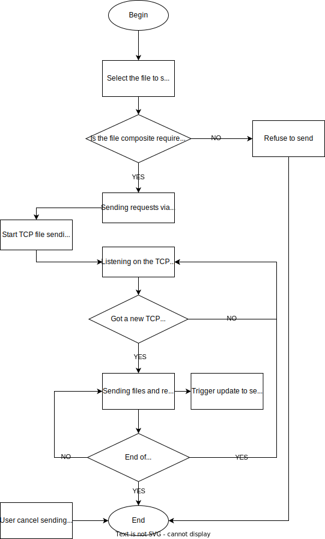

<!-- SPbSTU  -->

 

  
   
   
  <b>Санкт-Петербургский государственный политехнический университет</b> 
  <b>Институт компьютерных наук и технологий</b>

   

 
<b>PolyChat</b>

 
<b></b>

    <a href="/doc/README_CN.md">简体中文</a>

<!-- SPbSTU 最后一行 -->

[toc]

# Участники проекта и планирование

| Участник        | Ответственность                                                                        |
|-----------------|----------------------------------------------------------------------------------------|
| Валерий Фофанов | Внедрить функциональные модули, написать документацию                                  |
| Ли Ицзя         | Внедрить функциональные модули, поддерживать Канбан                                    |
| Мэн Цзянин      | Дизайн формы, построение и организация каркаса кода, реализация функциональных модулей |

# Требования

## Системные требования

Преподавание в Политехническом университете постепенно переходит от онлайнового к оффлайновому обучению. В аудиториях университетов преподаватели часто сталкиваются с проблемами при выдаче заданий или отправке документов студентам. Например, проектор в классе очень нечеткий, студенты на последнем ряду не могут прочитать слова, написанные на доске, преподавателю очень неудобно отправлять документы студентам по учебной сети и часто приходится отвечать на один и тот же вопрос несколько раз для разных студентов.

PolyChat - это кроссплатформенное программное обеспечение для обмена мгновенными сообщениями, предназначенное для решения вышеперечисленных проблем и повышения продуктивности работы преподавателей и студентов. Оно имеет следующие основные характеристики:

- Благодаря закрытому характеру локальной сети, для входа в систему пользователям необходимо указать только свое имя и номер группы, чтобы обеспечить простоту использования и безопасность

- Возможность пользователей быстро создавать групповые чаты и присоединяться к ним, а также отправлять в них сообщения и файлы

- Редактируемое форматирование текстовых сообщений

- Сохранение содержимого сообщения в txt-файл

- Очищение содержимого чата

## Технические требования

Основные технические потребности (требования) следующие

- Для обеспечения кроссплатформенности разработка будет вестись в Qt

- Чтобы соответствовать философии "высокая сплоченность, низкая связанность", разработка будет вестись с использованием трехуровневой архитектуры, разделяющей уровень представления (UI), уровень бизнес-логики (BLL) и уровень доступа к данным (DAL)

- Qt будет использоваться для кроссплатформенности и масштабируемости

- Для обмена текстовыми сообщениями используется протокол UDP, а для передачи файлов - протокол TCP

- Когда пользователь отправляет сообщение, оно транслируется на порт

- Socket UDP привязывается за фиксированным портом, а сигнал и слот используются для прослушивания входящих данных

# Функциональная спецификация

| Идентификатор                | Требование                                                                                                                                                                                                                                                                                |
| ---------------------------- |-------------------------------------------------------------------------------------------------------------------------------------------------------------------------------------------------------------------------------------------------------------------------------------------|
| Login_Deficient              | Если имя и/или номер группы не введены, будет выведено уведомление с текстом ошибки                                                                                                                                                                                                       |
| Login_Minimize               | При нажатии на кнопку минимизации окно сворачивается                                                                                                                                                                                                                                      |
| Login_Exit                   | При нажатии на кнопку закрытия происходит выход из основной программы                                                                                                                                                                                                                     |
|                              |                                                                                                                                                                                                                                                                                           |
| DialogList_Load              | При успешном входе пользователя в систему будет вызван список чатов (групповой чат в локальной сети) и загружен соответствующий файл ресурсов                                                                                                                                             |
| DialogList_Add_Chat          | Пользователи могут нажать на кнопку "Плюс", чтобы указать имя группового чата во всплывающем диалоговом окне, и будет создан групповой чат с таким именем. После создания нового группового чата список групповых чатов будет обновлен, чтобы добавить только что созданный групповой чат |
| DialogList_Add_Chat_Clash    | Если групповой чат с определенным именем уже существует, при попытке создать его снова появится уведомление с сообщением об ошибке                                                                                                                                                        |
| DialogList_View              | Пользователи могут использовать колесико мыши для просмотра содержимого списка                                                                                                                                                                                                            |
| DialogList_Select            | Пользователи могут выбрать групповой чат из списка чатов                                                                                                                                                                                                                                  |
| DialogList_Search            | Пользователи могут искать групповой чат по его названию через поисковую строку                                                                                                                                                                                                            |
| DialogList_Join              | При нажатии (выборе) группового чата в списке чатов, пользователь присоединится к групповому чату и появится окно чата                                                                                                                                                                    |
| DialogList_Join_Clash        | Когда пользователь присоединился к групповому чату, при повторном присоединении будет выведено уведомление с текстом ошибки                                                                                                                                                               |
| DialogList_Minimize          | При нажатии на кнопку минимизации окно сворачивается                                                                                                                                                                                                                                      |
| DialogList_Maximize          | При нажатии на кнопку полного экрана окно разворачивается на весь экран                                                                                                                                                                                                                   |
| DialogList_Exit              | При нажатии на кнопку закрытия происходит выход из основной программы                                                                                                                                                                                                                     |
|                              |                                                                                                                                                                                                                                                                                           |
| ChatWidget_Text_Font_Type    | (Выделить текст) Изменить шрифт в раскрывающемся списке. Шрифты, которые можно изменять, - это шрифты, уже установленные на компьютере                                                                                                                                                    |
| ChatWidget_Text_Font_Size    | (Выделить текст) Изменить размер текста в раскрывающемся списке, размер шрифта от 12 до 28                                                                                                                                                                                                |
| ChatWidget_Text_Font_B       | (Выделить текст) Нажатие на кнопку "Жирный" сделает текст жирным                                                                                                                                                                                                                          |
| ChatWidget_Text_Font_I       | (Выделить текст) Нажатие на кнопку "Курсив" сделает текст наклонным                                                                                                                                                                                                                       |
| ChatWidget_Text_Font_L       | (Выделить текст) Нажатие на кнопку "Подчеркивание" добавит подчеркивание в нижнюю часть текста                                                                                                                                                                                            |
| ChatWidget_Mess_View         | Пользователи могут использовать колесико мыши для просмотра журналов чата                                                                                                                                                                                                                 |
| ChatWidget_Mess_Clean        | Нажатие на кнопку "Очистить чат" очистит все журналы чата в своем окне, содержимое окон других пользователей не затрагивается                                                                                                                                                             |
| ChatWidget_Mess_Save         | Нажатие на кнопку "Сохранить" сохранит журнал чата в виде txt-файла                                                                                                                                                                                                                       |
| ChatWidget_Mess_Send         | Нажатие на кнопку "Отправить" отправит текст в поле ввода в групповой чат                                                                                                                                                                                                                 |
| ChatWidget_Mess_Send_Empty   | Когда поле ввода текста пустое, нажатие на кнопку "Отправить" ничего не отправляет                                                                                                                                                                                                        |
| ChatWidget_File_Send         | Пользователи могут выбрать файл и отправить его в групповой чат                                                                                                                                                                                                                           |
| ChatWidget_File_Send_Large   | Если размер файла превышает 1 Гб, он не будет отправлен                                                                                                                                                                                                                                   |
| ChatWidget_File_Receive      | Когда пользователь отправляет файл, другие пользователи могут выбирать, принимать его или нет                                                                                                                                                                                             |
| ChatWidget_File_Receive_Path | Если пользователь решит получить файл, то он может выбрать, где его сохранить                                                                                                                                                                                                             |
| ChatWidget_User_In           | Когда пользователь присоединяется к групповому чату, все пользователи получают сообщение                                                                                                                                                                                                  |
| ChatWidget_User_Out          | Пользователь, нажавший на кнопку выхода, выйдет из группового чата, в то время как другие пользователи не пострадают                                                                                                                                                                      |
| ChatWidget_User_Out_Mess     | Когда пользователь покидает групповой чат, все получают сообщение о том, что пользователь покинул чат                                                                                                                                                                                     |
| ChatWidget_Minimize          | При нажатии кнопки минимизации окно сворачивается                                                                                                                                                                                                                                         |
| ChatWidget_Maximize          | При нажатии на кнопку полного экрана окно разворачивается на весь экран                                                                                                                                                                                                                   |

# HLD

## Дизайн GUI

### Окно авторизации

### Список пользователей

### Окно чата

## Архитектура

Мы используем диаграмму Use Case для представления архитектуры программного обеспечения PolyChat:

## Диаграмма классов

В PolyChat существует 3 класса: список групп, группа и пользователь. Их взаимосвязь показана на диаграмме ниже:

## Раздел группового чата UDP

Эта программа реализует следующие функции: когда пользователь в локальной сети входит в программу чата, то в правой части интерфейса программы отображается список онлайн пользователей, которые отображаются как имя пользователя, номер группы, имя хоста и ip-адрес соответственно. Слева от списка находится экран отображения содержимого группового чата. Каждый пользователь может ввести текст в поле ввода (и изменить формат текста) и отправить его в чат.

### Сервер

После создания UDP-сокета и привязки его к фиксированному порту, сервер отслеживает входящие данные, используя сигналы и слоты. Если появляетя сообщение, он получает данные и анализирует тип сообщения. Если сообщение является входом нового пользователя, сервер обновляет список пользователей и добавляет уведомление о новом пользователе онлайн в окно отображения чата; аналогично, если пользователь находится в автономном режиме, сервер удаляет пользователя из списка пользователей и отображает уведомление об автономном режиме в окне отображения чата; если это сообщение чата, он получает сообщение и отображает его в окне. Технологическая схема выглядит следующим образом.

### Клиент

Первым делом, когда клиент входит в систему, он получает имя пользователя, номер группы, имя хоста и ip-адрес и передает их на сервер в локальной сети для обновления списка пользователей. Затем, когда клиенту нужно отправить сообщение, он вводит его в поле ввода чата и нажимает кнопку "Отправить", чтобы отправить содержимое чата, одновременно транслируя различные сообщения из локальной системы. Технологическая схема выглядит следующим образом:

## Секция передачи файлов TCP

### Сторона отправителя

***Сторона отправателя берет на себя роль сервера.***

Нажмите на кнопку отправки файла, чтобы открыть интерфейс отправителя, нажмите на кнопку "Открыть", выберите файл на локальном компьютере для отправки, нажмите на кнопку "Отправить", и индикатор выполнения покажет информацию о текущей передаче файла, включая информацию о размере передаваемого файла, скорости передачи и оставшееся время передачи. Если вы хотите закрыть процесс отправки, нажмите кнопку "Закрыть". Технологическая схема выглядит следующим образом:

### Сторона получателя

***Сторона получателя берет на себя роль клиента.***

Когда в главном интерфейсе появляется диалоговое окно с вопросом, принимать ли сообщение о передаче файла от пользователя, нажмите кнопку "Да", если вы принимаете его, в противном случае нажмите кнопку "Нет". При приеме файла выберите каталог и имя файла, в который хотите сохранить файл, и начните прием файла. В процессе также будет отображаться информация о размере принятого файла, скорости приема и оставшемся времени приема. Технологическая схема выглядит следующим образом.

## Потоки данных

Мы используем диаграмму потоков данных для представления обработки сообщений, полученных в окне группового чата PolyChat:

