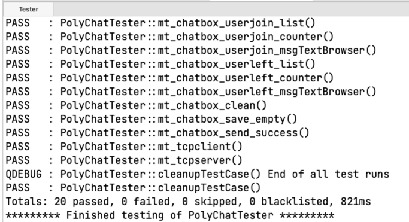
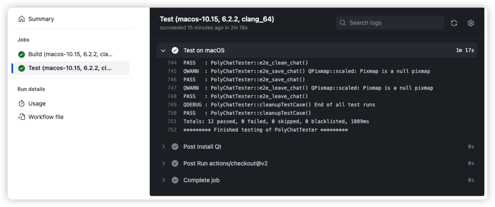
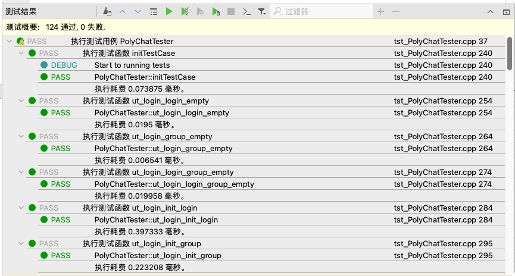
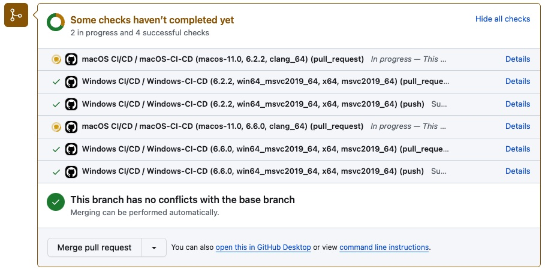
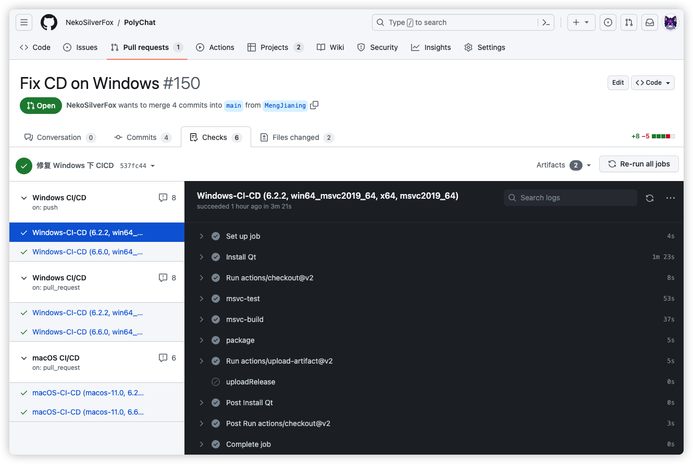
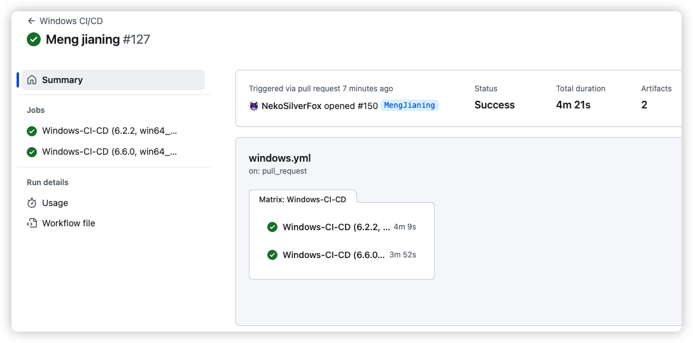
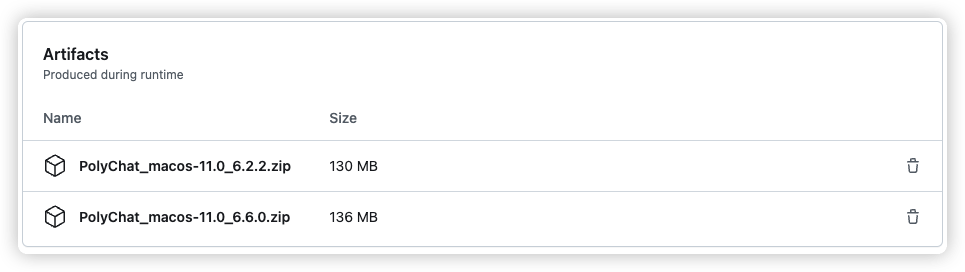
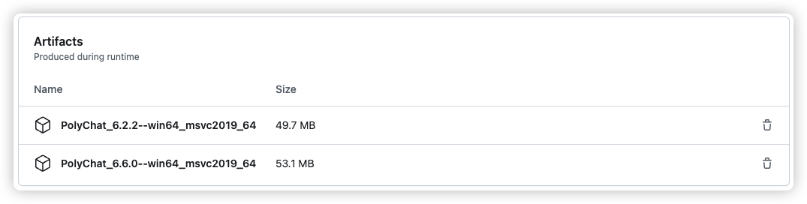
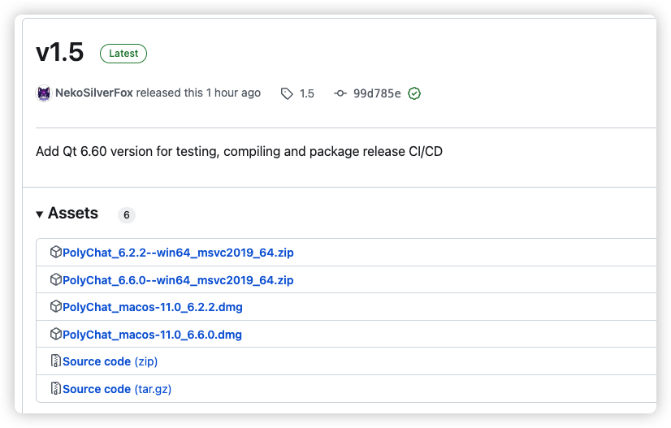

<!-- SPbSTU  -->

 <p align="center">
  
  </br>
  </br>
  <b><font size=4>Санкт-Петербургский государственный политехнический университет</font></b></br>
  <b>Институт компьютерных наук и технологий</b>

  <br>

 <p align="center"><b><font size=6>PolyChat</font></b></p>
 <p align="center"><b>教学聊天系统</b></p>

 <p align="center"></p>

<p align="center">
    <a href="../README.md">Руский язык</a>
    <a href="./README_EN.md">English</a>
</p>


<div align=left>
<!-- SPbSTU 最后一行 -->


<div align=center>

[](LICENSE)

[](https://github.com/NekoSilverFox/PolyChat/actions/workflows/macos.yml)
[](https://github.com/NekoSilverFox/PolyChat/actions/workflows/windows.yml)

</div>


[toc]

# 需求

## 系统需求

现在理工大学的教学逐渐的从线上授课模式转换为线下授课模式。而在大学中的教室中授课时，经常会发生老师向学生下达任务或者发送文件时遇到各种问题。比如教室里的投影仪非常不清晰、后排同学无法看清黑板上写的字、老师在学校网络环境下向学生发送文件非常不方便、老师经常需要对不同学生对同一问题进行重复解答。

PolyChat 是一款跨平台即时通讯软件，旨在解决上述问题，提高老师和学生的工作效率。它有以下主要功能：

- 得益于局域网的封闭性，为了保证易用性和安全，用户只需要提供姓名和班级号码即可登录使用
- 用户可以快速组建和加入群聊，并在其中发送消息和文件
- 可编辑文本消息的格式
- 将消息内容保存为文件
- 清空聊天内容


## 技术性需求

有以下的主要的技术需求（要求）

- 为了保证跨平台性，将使用 Qt 进行开发
- 为了符合“高内聚，低耦合”思想，将采用三层架构的方式进行开发，把表示层（UI）、业务逻辑层（BLL）和数据访问层（DAL）分离
- 为了实现跨平性和可扩展性，将使用 Qt 进行开发。
- 文本消息传递采用 UDP 协议，而文件传输采用 TCP 协议。
- 当用户发送消息时，会在端口上进行广播。
- 在固定端口后绑定 UDP Socket，用信号与槽的方式进行监听是否有数据来临
- 借助 GitHub 平台的 Action 实现 CI/CD，自动测试、构建、打包、发布


# 功能规范

| 标识符                       | 解释                                                         |
| ---------------------------- | ------------------------------------------------------------ |
| Login_Deficient              | 如果姓名或者班级号有一个没有输入时，将显示一个通知，其中包括错误的文本 |
| Login_Minimize               | 当点击最小化按钮时，窗口会被最小化                           |
| Login_Maximize               | 当点击关闭按钮时，主程序退出                                 |
|                              |                                                              |
| DialogList_Load              | 当用户成功登陆，对话框列表（局域网中的群聊）会被调用，并且相应资源文件会被加载 |
| DialogList_Add_Chat          | 用户可以点击加号按钮，通过弹出的对话框指定群聊名称，之后该名称的群聊将会被创建。创建新群聊之后，群聊列表将会被刷新以增加新创建的群聊 |
| DialogList_Add_Chat_Clash    | 当某个名称的群聊已经存在时，如果尝试重复创建将会显示一个通知，其中包括错误信息 |
| DialogList_View              | 用户可以使用鼠标滚轮查看列表中的内容                         |
| DialogList_Select            | 用户可以在对话框列表中选择某个群聊                           |
| DialogList_Search            | 用户可以通过搜索框，通过群聊的名称搜索一个群聊               |
| DialogList_Join              | 当对话框列表中的某个群聊被点击(选中)时，此用户会加入群聊，并且会弹出聊天窗口 |
| DialogList_Join_Clash        | 当用户已经加入某个群聊时，如果再次加入会将显示一个通知，其中包括错误的文本 |
| DialogList_Minimize          | 当点击最小化按钮时，窗口会被最小化                           |
| DialogList_Maximize          | 当点击全屏按钮时，窗口会铺满整个屏幕                         |
| DialogList_Exit              | 按下关闭按钮，退出主程序                                     |
|                              |                                                              |
| ChatWidget_Text_Font_Type    | (选中一段文字)可以在下拉列表中修改字体，可修改的字体为电脑上已安装的。 |
| ChatWidget_Text_Font_Size    | (选中一段文字)可以在下拉列表中修改文字大小，字体大小从 12 到 28 |
| ChatWidget_Text_Font_B       | (选中一段文字)点击加粗按钮会使文字加粗                       |
| ChatWidget_Text_Font_I       | (选中一段文字)点击斜体按钮会使文字倾斜                       |
| ChatWidget_Text_Font_L       | (选中一段文字)点击下划线按钮会在文字底部添加下划线           |
| ChatWidget_Mess_View         | 用户可以使用鼠标滚轮查看聊天记录                             |
| ChatWidget_Mess_Clean        | 点击清空聊天记录按钮会清空自己窗口内的所有聊天记录，其他用户的窗口内容不受影响 |
| ChatWidget_Mess_Save         | 点击保存按钮可以将聊天记录保存为 txt 文件                    |
| ChatWidget_Mess_Send         | 点击发送按钮可以将输入框中的文字内容发送至群聊               |
| ChatWidget_Mess_Send_Empty   | 当文字输入框为空时，点击发送按钮无法发送任何内容             |
| ChatWidget_File_Send         | 用户可以选择一个文件，将其发送至群聊中                       |
| ChatWidget_File_Send_Large   | 如果文件大于 1Gb，那么将无法发送                             |
| ChatWidget_File_Receive      | 当用户发送文件后，其他用户可以选择是否接受此文件             |
| ChatWidget_File_Receive_Path | 如果用户选择接收文件，那么可以选择文件的保存位置             |
| ChatWidget_User_In           | 某为用户加入群聊时，所有用户都会收到消息                     |
| ChatWidget_User_Out          | 某位用户点击退出按钮会退出群聊，而其他用户不受影响           |
| ChatWidget_User_Out_Mess     | 某位用户退出群聊时，所有人都会收到此用户退出的消息           |
| ChatWidget_Minimize          | 当点击最小化按钮时，窗口会被最小化                           |
| ChatWidget_Maximize          | 当点击全屏按钮时，窗口会铺满整个屏幕                         |


# HLD


## 界面设计

### 登录


### 用户列表界面


### 聊天窗口


## 软件架构

我们使用用例图来表述 PolyChat 的软件架构：


## 类图

PolyChat 中存在 3 个类，分别是群组列表、群组、用户类。他们的关系如下图所示：


## UDP 群聊部分与群组列表

本程序实现的功能是：局域网内，用户可以添加（创建）一个群聊，当一个群聊被创建时，其他主机上的群聊列表要同步更新（通过 UDP）。

每个用户加入到群聊后，则群聊界面的右端可以显示在线用户列表，分别显示的是用户名、班级号、ip地址。窗体左边是聊天内容显示界面，即群聊。每个人可以在聊天输入界面中输入文字（还可修改文字格式）并发送。

UDP 消息通过 `Broadcast` 机制在局域网中进行广播，并且使用了 `ShareAddress` 和 `ReuseAddressHint` 增强易用性，以下是它们的解释：

- `Broadcast`：在当前局域网中的所有端口进行广播
- `ShareAddress`：允许其他服务绑定到同一地址和端口。当多个进程通过监听同一地址和端口来分担一个服务的负载时，这很有用（例如，一个有多个预分叉监听器的Web服务器可以大大改善响应时间）。然而，由于任何服务都被允许重新绑定，这个选项要考虑到某些安全问题。所以通过把这个选项和 `ReuseAddressHint` 结合起来。
- `ReuseAddressHint`：即使地址和端口已经被另一个套接字绑定，它也应该尝试重新绑定该服务。


### UDP 通讯协议

为了实现上述功能，并且保证程序的后期可拓展性。采用了定制的通讯协议，其中存在 8 个块：

- `第1块`：消息类型。目前有 6 种类型：
    - `ChatExist`: 当前群聊窗口存在，每隔一段时间广播一次
    - `ChatDestory`：删除当前群聊，当群聊中所有（最后一位）退用户出时发出
    - `Msg`：普通的文字消息
    - `File`：文件发送请求
    - `UserJoin`：用户加入当前群聊
    - `UserLeft`：用户离开当前群聊
- `第2块`：当前群聊的名字
- `第3块`：当前群聊位于的端口
- `第4块`：发送本消息的用户名
- `第5块`：发送本消息的用户所属班级
- `第6块`：发送本消息的用户 IP 地址
- `第7块`：消息内容（长度可变）
- `第8块`：消息内容（长度可变，用于拓展第 7 段）

如下图所示：


### 服务器

**注意：在 PolyChat 中的聊天系统，类似于 P2P。一个用户既可以充当服务器又可以充当客户端。**

建立一个UDP Socket并绑定在固定端口后，用信号与槽的方式进行监听是否有数据来临。如果有，接收其数据并分析数据的消息类型，如果消息是新用户登录则更新用户列表并在聊天显示窗口中添加新用户上线通知；同理，如果是用户下线，则在用户列表中删除该用户且在聊天显示窗口中显示下线通知；如果是聊天消息，则接收该消息并且在窗口中显示。其流程图如下：


### 客户端

**注意：在 PolyChat 中的聊天系统，类似于 P2P。一个用户既可以充当服务器又可以充当客户端。**

首先当用户加入群聊时，获取用户名，班级号，主机名和ip地址，并广播给局域网的服务器（ChatBoxWidget）更新右侧的用户列表。然后当客户端需要发送信息时，则在聊天输入栏中输入信息并按发送键发送聊天内容，当然于此同时也广播本地系统的各种信息。其流程图如下：


## TCP文件传输部分

### TCP通讯协议

TCP 采用了定制的通讯协议，其中存在 4 个部分：

1~3 部分为文件头，第 4 部分为实际数据

- `第1部分`: 文件名
- `第2部分`: 文件大小（Byte）
- `第3部分`: 文件的 MD5
- `第4部分`: 数据（每个数据块的大小为 4Kb）

在传输中，服务端将首先发送文件头。为了防止 TCP 黏包，等待 20ms 后再开始发送数据块


### 发送端

发送端，也即承担服务器角色的操作。


点击文件发送按钮，在本地计算机中选择需要发送的文件，点击发送按钮，弹出发送端界面后，则进度条上会显示当前文件传送的信息，有已传送文件大小信息，传送速度等信息。如果想关闭发送过程，则单击关闭按钮。其流程图如下：


### 接收端

**接收端，也即承担客户端角色的操作。**

在界面中弹出一个对话框，问是否接自某个用户的文件传送信息，如果接受则单击 Yes 按钮，否则就单击 No 按钮。


当接收文件时，选择好接收文件所存目录和文件名后就开始接收文件了，其过程也会显示接收文件的进度，接收端和客户端相关的信息。接收端的界面如下图所示：


其流程图如下：


## 数据流

我们使用数据流图来表示 PolyChat 群聊窗口的信息接收处理过程：


# 测试

> 由于 GitHub 不再支持 MacOS 10.15, clang_64 所以已经将持续集成 CI 中的 MacOS 版本更新为 MacOS 11.0

## 说明

将使用 QTest 对 PolyChat 进行测试。

QTestlib是Qt提供的一种针对基于Qt编写的程序或库的单元测试框架。QTestLib提供了单元测试框架的基本功能，并提供了针对GUI测试的扩展功能。以下是 QTestlib 的特性：

A、轻量级：QTestlib只包含6000行代码和60个导出符号
B、自包含：对于非GUI测试，QTestlib只需要Qt核心库的几个符号。
C、快速测试：QTestlib不需要特殊的测试执行程序，不需要为测试而进行特殊的注册。
D、数据驱动测试：一个测试程序可以在不同的测试数据集上执行多次。
E、基本的GUI测试：QTestlib提供了模拟鼠标和键盘事件的功能。
F、基准测试：QTestLIB支持基准测试并提供多种测量后端。
G、IDE友好：QTestlib的输出信息可以被Visual Studio和KDevelop解析。
H、线程安全：错误报告是线程安全的、原子性的。
J、类型安全：对模板进行了扩展使用，防止由隐式类型转换引起的错误。
K、易扩展：用户自定义类型可以容易地加入到测试数据和测试输出中。

测试必须在项目用生成可执行文件的构建器 qmake 构建时自动完成。在 Github 上使用了 CI/CD，触发器将会在代码更改时进行自动在 Windows 和 macOS 平台上进行构建和测试（同时在两个平台上进行测试是为了保证 PolyChat 的跨平台性）。

## 扩展测试套件的程序

当添加新的代码时，测试套件应通过添加新的测试案例来扩展，其属性如下。

- 测试名称（标识符）包括测试级别，相关模块和测试对象
- 受测试影响的相关模块
- 描述状态/动作的预期结果和应用程序对它们的响应

如果新的代码也改变了软件的行为，所有与受影响的产品模块相关的测试用例应该被检查和重写，以匹配新的行为。

## 单元（模块）测试

几个测试设计技术被应用:

- 等价类

    ```c++
    void PolyChatTester::ut_login_login_empty()
    {
        bool isSuccInitLocalUser = DAL::initLocalUser("", "3530904/90102");
        QCOMPARE(isSuccInitLocalUser, false);
    }
    ```

    

- 边界条件

    ```c++
    void PolyChatTester::ut_chatbox_cbxFontSize_min_max()
    {
        ChatBoxWidget chatBox(nullptr, "3530409/90102", 2333);
        QComboBox* cbox = chatBox.findChild<QComboBox*>("cbxFontSize");
        qDebug() << " cbox->count();" << cbox->count();
        QCOMPARE(cbox->itemText(0).toInt(), 10);
        QCOMPARE(cbox->itemText(cbox->count() - 1).toInt(), 28);
    }
    ```

    

- 成对测试

    ```c++
    void PolyChatTester::ut_chatbox_btnBold()
    {
        ChatBoxWidget chatBox(nullptr, "3530409/90102", 2333);
        QToolButton* button = chatBox.findChild<QToolButton*>("btnBold");
    
        QCOMPARE(button->isCheckable(), true);
        QCOMPARE(button->toolButtonStyle(), Qt::ToolButtonStyle::ToolButtonIconOnly);
    }
    ```

    

|      | 测试名                           | 所属模块    | 说明（预期结果）                                             |
| ---- | -------------------------------- | ----------- | ------------------------------------------------------------ |
| 1   | ut_login_login_empty             | Login       | 登录失败（用户名不能为空）                                   |
| 2   | ut_login_group_empty             | Login       | 登录失败（班级号不能为空）                                   |
| 3   | ut_login_login_group_empty       | Login       | 登录失败（用户名和班级号不能为空）                           |
| 4   | ut_login_init_login              | Login       | 传入正确格式的登录名，本地信息被正确初始化                   |
| 5   | ut_login_init_group              | Login       | 传入正确格式的班级号，本地信息被正确初始化                   |
| 6   | ut_login_btnlogin                | Login       | 保证 btnlogin 是非可选按钮，且图标显示被禁用                 |
| 7   | ut_login_btnlogin_emit           | Login       | 用户每次点击登录按钮时，保证（按钮点击）信号正确触发，且为一次 |
| 8   | ut_login_btnInfo_emit            | Login       | 用户每次点击 btnInfo 时，保证（按钮点击）信号正确触发，且为一次 |
| 9    | ut_login_window                  | Login       | Login 窗口的大小被禁止缩放，并且为 400x250                   |
| 10   | ut_addchat_btnCancelAddChat      | Add Chat    | 用户每次点击取消按钮时，保证（按钮点击）信号正确触发，且为一次 |
| 11   | ut_addchat_btnAddChat            | Add Chat    | 用户每次点击添加按钮时，保证（按钮点击）信号正确触发，且为一次 |
| 12   | ut_chat_init                     | Chat(Class) | 正确初始化（使用构造函数）一个 Chat 对象                     |
| 13   | ut_chatlist_init                 | ChatList    | 正确初始化（使用构造函数）一个 ChatList 对象                 |
| 14   | ut_chatlist_btnNewChat           | ChatList    | 保证 btnNewChat 是可选按钮（Checkable-QToolButton），且文字显示被禁用 |
| 15   | ut_chatlist_btnNewChat_emit      | ChatList    | 用户每次点击增加群聊按钮时，保证（按钮点击）信号正确触发，且为一次 |
| 16   | ut_chatlist_leSearch             | ChatList    | 模拟用户点击并且通过键盘输入，确保输入内容在 leSearch 搜索框中正确显示 |
| 17   | ut_chatlist_lbName               | ChatList    | lbName 中正确显示本用户的用户名                              |
| 18   | ut_chatlist_lbGroupNumber        | ChatList    | lbGroupNumber 中正确显示本用户的班级号                       |
| 19   | ut_chatlist_lbIP                 | ChatList    | lbIP 中正确显示本用户的 ip 地址                              |
| 20   | ut_addchat_port_exist            | ChatList    | 返回 true（当前端口上已存在群聊）                            |
| 21   | ut_addchat_port_not_exist        | ChatList    | 返回 false（当前端口上不存在群聊）                           |
| 22   | ut_addchat_chat_exist            | ChatList    | 返回 true（已存在同名的群聊）                                |
| 23   | ut_addchat_chat_not_exist        | ChatList    | 返回 false（不存在同名的群聊）                               |
| 24   | ut_chatlist_chat_not_open        | ChatList    | 返回 true（如果某个名称的群聊没有被打开）                    |
| 25   | ut_chatlist_chat_open            | ChatList    | 返回 false（如果某个名称的群聊被打开了）                     |
| 26   | mt_chatlist_getRandomPort | ChatList | 生成的随机端口介于 PORT_MIN 与 PORT_MAX |
| 27   | mt_chatlist_setChatState | ChatList | 正常设置聊天窗口为打开或者关闭 |
| 28   | ut_tcpclient_lbClientIP          | TcpClient   | lbClientIP 内容正确解析且显示                                |
| 29   | ut_tcpclient_lbClientPort        | TcpClient   | lbClientPort 内容正确解析且显示                              |
| 30   | ut_tcpclient_lbServerIP          | TcpClient   | lbServerIP 内容正确解析且显示                                |
| 31   | ut_tcpclient_lbServerPort        | TcpClient   | lbServerPort 内容正确解析且显示                              |
| 32   | ut_tcpclient_lbFileName          | TcpClient   | lbFileName 内容正确解析且显示                                |
| 33   | ut_tcpclient_lbFileSize          | TcpClient   | lbFileSize 内容正确解析且显示                                |
| 34   | ut_tcpclient_progressBar         | TcpClient   | progressBar 初始化时为 0                                     |
| 35   | ut_tcpclient_btnCancel           | TcpClient   | 保证 btnCancel 是非可选按钮                                  |
| 36   | ut_tcpclient_btnCancel_emit      | TcpClient   | 用户每次点击取消按钮时，保证（按钮点击）信号正确触发，且为一次 |
| 37   | ut_tcpclient_btnSave             | TcpClient   | 保证 btnSave 是非可选按钮                                    |
| 38   | ut_tcpclient_btnSave_emit        | TcpClient   | 用户每次点击保存按钮时，保证（按钮点击）信号正确触发，且为一次 |
| 39   | ut_tcpclient_closeEvent_emit     | TcpClient   | 用户关闭窗口时触发关闭事件                                   |
| 40   | ut_tcpclient_textBrowser         | TcpClient   | textBrowser 为只读状态，禁止写入                             |
| 41   | ut_tcpserver_lbClientIP          | TcpServer   | lbClientIP 内容正确解析且显示                                |
| 42   | ut_tcpserver_lbClientPort        | TcpServer   | lbClientPort 内容正确解析且显示                              |
| 43   | ut_tcpserver_lbServerIP          | TcpServer   | lbServerIP 内容正确解析且显示                                |
| 44   | ut_tcpserver_lbServerPort        | TcpServer   | lbServerPort 内容正确解析且显示                              |
| 45   | ut_tcpserver_lbFilePath          | TcpServer   | lbFilePath 内容正确解析且显示                                |
| 46   | ut_tcpserver_lbFileSize          | TcpServer   | lbFileSize 内容正确解析且显示                                |
| 47   | ut_tcpserver_btnCancel           | TcpServer   | 保证 btnCancel 是非可选按钮                                  |
| 48   | ut_tcpserver_btnCancel_emit      | TcpServer   | 用户每次点击取消按钮时，保证（按钮点击）信号正确触发，且为一次 |
| 49   | ut_tcpserver_progressBar         | TcpServer   | progressBar 初始化时为 0                                     |
| 50   | ut_tcpserver_closeEvent_emit     | TcpServer   | 用户关闭窗口时触发关闭事件                                   |
| 51   | ut_tcpserver_textBrowser         | TcpServer   | textBrowser 为只读状态，禁止写入                             |
| 52   | ut_chatbox_title                 | ChatBox     | ChatBox 窗口的标题正确初始化（符合格式）                     |
| 53   | ut_chatbox_btnBold               | ChatBox     | 保证 btnBold 是可选按钮（Checkable-QToolButton），且文字显示被禁用 |
| 54   | ut_chatbox_btnItalic             | ChatBox     | 保证 btnItalic 是可选按钮（Checkable-QToolButton），且文字显示被禁用 |
| 55   | ut_chatbox_btnUnderLine          | ChatBox     | 保证 btnUnderLine 是可选按钮（Checkable-QToolButton），且文字显示被禁用 |
| 56   | ut_chatbox_btnColor              | ChatBox     | 保证 btnColor 不是可选按钮（Checkable-QToolButton），且文字显示被禁用 |
| 57   | ut_chatbox_btnFileSend           | ChatBox     | 保证 btnFileSend 不是可选按钮（Checkable-QToolButton），且文字显示被禁用 |
| 58   | ut_chatbox_btnSave               | ChatBox     | 保证 btnSave 不是可选按钮（Checkable-QToolButton），且文字显示被禁用 |
| 59   | ut_chatbox_btnClean              | ChatBox     | 保证 btnClean 不是可选按钮（Checkable-QToolButton），且文字显示被禁用 |
| 60   | ut_chatbox_btnExit               | ChatBox     | 保证 btnExit 不是可选按钮（Checkable）                       |
| 61   | ut_chatbox_btnSend               | ChatBox     | 保证 btnSend 不是可选按钮（Checkable）                       |
| 62   | ut_chatbox_btnBold_emit          | ChatBox     | 点击 btnBold 触发（按钮点击）信号，且状态改变为 enable；再次点击恢复为初始状态 |
| 63   | ut_chatbox_btnItalic_emit        | ChatBox     | 点击 btnItalic 触发（按钮点击）信号，且状态改变为 enable；再次点击恢复为初始状态 |
| 64   | ut_chatbox_btnUnderLine_emit     | ChatBox     | 点击 btnUnderLine 触发（按钮点击）信号，且状态改变为 enable；再次点击恢复为初始状态 |
| 65   | ut_chatbox_btnColor_emit         | ChatBox     | 点击 btnColor 触发（按钮点击）信号                           |
| 66   | ut_chatbox_btnFileSend_emit      | ChatBox     | 点击 btnFileSend 触发（按钮点击）信号                        |
| 67   | ut_chatbox_btnSave_emit          | ChatBox     | 点击 btnSave 触发（按钮点击）信号                            |
| 68   | ut_chatbox_btnClean_emit         | ChatBox     | 点击 btnClean 触发（按钮点击）信号                           |
| 69   | ut_chatbox_btnExit_emit          | ChatBox     | 点击 btnExit 触发（按钮点击）信号                            |
| 70   | ut_chatbox_btnSend_emit          | ChatBox     | 点击 btnSend 触发（按钮点击）信号                            |
| 71   | ut_chatbox_msgTextBrowser        | ChatBox     | msgTextBrowser 为只读状态                                    |
| 72   | ut_chatbox_msgTextEdit           | ChatBox     | msgTextEdit 允许写入                                         |
| 73   | ut_chatbox_init_cbxFontSize      | ChatBox     | 初始字体为 12                                                |
| 74   | ut_chatbox_cbxFontSize_min_max   | ChatBox     | 最小字体为 10，最大为 28                                     |
| 75   | ut_chatbox_closeEvent_emit       | ChatBox     | 用户关闭窗口（退出）时触发关闭事件                           |
| 76   | ut_chatbox_tbUser                | ChatBox     | 用户列表的宽度为 150-350                                     |
| 77   | ut_chatbox_lbNumberOnlineUse     | ChatBox     | 在线人数的 UI 初始化为正确格式                               |

## 集成（接口）测试

对以下模块进行了集成测试：Login、Add Chat、ChatList、ChatBox、TcpClient、TcpServer。并在 Qt 中通过使用初始化（调用）单个窗口来隔离外部环境和排除其他窗口可能造成的影响。并且在其中的一些测试中，为了反应用户真实的使用场景，采取了模拟用户使用键盘输入的方式。

**几个测试设计技术被应用:**

- 等价类

    ```c++
    void PolyChatTester::mt_chatlist_leSearch_change_emit()
    {
        DAL::initLocalUser("Fox", "3530904/90102");
        ChatList widget(nullptr, DAL::getLocalUserName(), DAL::getLocalUserGroupNumber(), DAL::getLocalIpAddress());
        QLineEdit* lineEdit = widget.findChild<QLineEdit*>("leSearch");
    
        QSignalSpy spy(lineEdit, &QLineEdit::textEdited);
        QTest::keyClicks(lineEdit, "90111");
        QCOMPARE(spy.count(), 5);
    }
    ```

    

- 边界条件

    ```c++
    bool PolyChatTester::mt_chatlist_getRandomPort()
    {
        ChatList widget(nullptr, DAL::getLocalUserName(), DAL::getLocalUserGroupNumber(), DAL::getLocalIpAddress());
        for (int i = 0; i < PORT_MAX - PORT_MIN; i++)
        {
            qint16 port = widget.getRandomPort();
            if (port > PORT_MAX || port < PORT_MIN) return false;
        }
        return true;
    }
    ```

    

- 成对测试

    ```c++
    void PolyChatTester::mt_chatbox_save_empty()
    {
        QTimer* timer = new QTimer(this);
        connect(timer, &QTimer::timeout, this, [=](){
            QWidgetList topWidgets = QApplication::topLevelWidgets();
            foreach (QWidget *w, topWidgets) {
                if (QMessageBox *mb = qobject_cast<QMessageBox *>(w)) {
                    QTest::keyClick(mb, Qt::Key_Enter);
                } else if (QFileDialog* dialog = qobject_cast<QFileDialog *>(w)) {
                    QTest::keyClick(dialog, Qt::Key_Cancel);
                } else if (QColorDialog* dialog = qobject_cast<QColorDialog *>(w)) {
                    QTest::keyClick(dialog, Qt::Key_Enter);
                } else {
                    w->close();
                }
            }
        });
      
        timer->start(50);
        ChatBoxWidget chatBox(nullptr, "3530409/90102", 2333);
    
        QTextBrowser* msgTextBrowser = chatBox.findChild<QTextBrowser*>("msgTextBrowser");
        QCOMPARE(msgTextBrowser->toPlainText(), "");
    
    
        QToolButton* button = chatBox.findChild<QToolButton*>("btnSave");
        QTest::mouseClick(button, Qt::LeftButton);
        timer->stop();
    }
    ```

**测试：**

|      | 测试名                             | 所属模块  | 说明（预期结果）                                             |
| ---- | ---------------------------------- | --------- | ------------------------------------------------------------ |
| 78   | mt_login_init_succ                 | Login     | 模拟用户在使用键盘在输入框中输入内容，然后点击登录按钮（登陆成功，本地用户信息被正确初始化） |
| 79   | mt_login_leUserName                | Login     | 模拟用户点击并且通过键盘输入，确保输入内容在 leUserName 输入框中正确显示 |
| 80   | mt_login_leUserGroupNumber         | Login     | 模拟用户点击并且通过键盘输入，确保输入内容在 leUserGroupNumber 输入框中正确显示 |
| 81   | mt_addchat_leNameNewChat           | Add Chat  | 模拟用户点击并且通过键盘输入，确保输入内容在 leNameNewChat 输入框中正确显示 |
| 82   | mt_chatlist_leSearch_change_emit   | ChatList  | 当用户改变搜索框中的内容时，触发正确次数的信号               |
| 83   | mt_chatlist_getNewBtn              | ChatList  | 根据传入的参数，所创建的新按钮对象中拥有正确的信息           |
| 84   |                                    |           |                                                              |
| 85   |                                    |           |                                                              |
| 86   | mt_chatlist_btnchat_exist          | ChatList  | 当增加新的聊天群组时，ui 界面正确刷新                        |
| 87   | mt_chatbox_userjoin_list           | ChatBox   | 用户加入（用户列表正确刷新）                                 |
| 88   | mt_chatbox_userjoin_counter        | ChatBox   | 用户加入（计数器正确增加，并且ui的显示格式及内容正确）       |
| 89   | mt_chatbox_userjoin_msgTextBrowser | ChatBox   | 用户加入（msgTextBrowser 被刷新）                            |
| 90   | mt_chatbox_userleft_list           | ChatBox   | 用户离开（用户列表正确刷新）                                 |
| 91   | mt_chatbox_userleft_conter         | ChatBox   | 用户离开（计数器正确增加，并且ui的显示格式及内容正确）       |
| 92   | mt_chatbox_userleft_msgTextBrowser | ChatBox   | 用户离开（msgTextBrowser 被刷新）                            |
| 93   | mt_chatbox_clean                   | ChatBox   | 当清空聊天框的时候提示警告信息                               |
| 94   | mt_chatbox_save_empty              | ChatBox   | 当清空聊天框中无内容时，模拟模拟用户点击“保存聊天记录”按钮（提示警告信息） |
| 95   | mt_chatbox_send_success            | ChatBox   | 模拟用户在使用键盘在聊天框中输入内容，然后点击发送按钮。输入的信息正确显示在消息框汇总（消息成功发送） |
| 96   | mt_tcpclient                       | TcpClient | ui 界面的所有控件经过接口初始化为正确内容                    |
| 97   | mt_tcpserver                       | TcpServer | ui 界面的所有控件经过接口初始化为正确内容                    |

**集成测试结果:**



## 系统/端到端和其他测试

*关于持续集成和在GitHub中设置触发器的更多信息，请参见后面的集成测试部分。*

| 编号 | 测试名                   | 说明（预期结果）                                             |
| ---- | ------------------------ | ------------------------------------------------------------ |
| 96   | e2e_add_new_chat         | 1. 由用户打开程序<br/>2. 用户点击用户名输入栏，用键盘输入内容<br/>3. 用户点击组号输入栏，用键盘输入内容<br/>4. 用户在登录按钮上点击鼠标<br/>5. 用户点击 "添加新的群组聊天 "按钮<br/>6. 用户在出现的 "添加聊天 "对话框中输入文字<br/>7. 用户点击 "确认 "按钮，添加新的群聊 |
| 97   | e2e_join_chat            | 1-4. 用户已登录<br/>5. 用户点击聊天列表中的聊天按钮          |
| 98   | e2e_search_chat          | 1-4. 用户已登录<br/>5. 用户点击聊天搜索栏，用键盘输入一个名字<br/>6. 用户点击找到的聊天列表中的聊天按钮 |
| 99   | e2e_send_message         | 1-4. 用户已登录<br/>5. 用户点击聊天列表中的聊天按钮<br/>6. 用户点击聊天区域，用键盘输入内容<br/>7. 用户点击 "发送 "按钮 |
| 100  | e2e_send_special_message | 1-4. 用户已登录<br/>5. 用户点击聊天列表中的聊天按钮<br/>6. 用户点击聊天区域，用键盘输入内容<br/>7. 用户点击文字更改样式按钮（加粗、倾斜等）<br/>8. 用户点击发送按钮 |
| 101  | e2e_send_file            | 1-4. 用户已登录<br/>5. 用户点击聊天列表中的聊天按钮<br/>6. 用户点击发送文件按钮<br/>7. 用户选择一个要发送的文件<br/>8. 用户按下发送按钮 |
| 102  | e2e_receive_file         | 1-4. 用户已登录<br/>5. 用户点击聊天列表中的聊天按钮<br/>6. 当出现对话框询问他们是否要接受文件时，用户点击 "是 "按钮<br/>7. 用户选择保存所接收文件的目录和文件名<br/>8. 用户按下保存按钮 |
| 103  | e2e_clean_chat           | 1-4. 用户已登录<br/>5. 用户点击聊天列表中的聊天按钮<br/>6. 用户点击 "清除聊天 "按钮 |
| 104  | e2e_save_chat            | 1-4. 用户已登录<br/>5. 用户点击聊天列表中的聊天按钮<br/>6. 用户点击 "保存聊天 "按钮 |
| 105  | e2e_leave_chat           | 1-4. 用户已登录<br/>5. 用户点击聊天列表中的聊天按钮<br/>6. 用户点击聊天区域，用键盘输入内容<br/>7. 用户点击发送按钮<br/>8. 其他用户加入群聊<br/>9. 其他用户离开群聊<br />10. 用户点击 "退出聊天 "按钮 |

**GitHub 结果：**



## 其他测试

|      | 测试名 | 类型     | 所属模块  | 说明（预期结果）    |
| :--- | ------ | :------- | :-------- | :------------------ |
| 106  | pt_Login_load                | 性能测试 | Login            | 窗口加载/调用的性能 |
| 107  | pt_AddChat_load              | 性能测试 | Add Chat         | 窗口加载/调用的性能 |
| 108  | pt_ChatList_load             | 性能测试 | ChatList         | 窗口加载/调用的性能 |
| 109  | pt_TcpClient_load            | 性能测试 | TcpClient        | 窗口加载/调用的性能 |
| 110  | pt_TcpServer_load            | 性能测试 | ChatBox          | 窗口加载/调用的性能 |
| 111  | pt_ChatBox_load              | 性能测试 | ChatBox          | 窗口加载/调用的性能 |
| 112  | pt_ChatBox_userjoin          | 性能测试 | ChatBox          | 用户进入群聊 |
| 113  | pt_ChatBox_userjoin_left     | 性能测试 | ChatBox          | 用户进入群聊并伴随其他用户离开 |
| 114  | pt_ChatBox_msgTextEdit_input | 性能测试 | ChatBox          | 模拟用户键盘在 msgTextEdit 中输入100 个字符，然后点击发送按钮 |
| 115  | pt_Login_to_system           | 性能测试 | Login/ChatList   | 用户通过键盘输入姓名和班级编号，然后点击登录按钮进入系统（ChatList） |
| 116  | pt_AddChat_ui                | 性能测试 | Add Chat/ChatBox | 通过 Add Chat 模拟用户输入，然后点击确认按钮来增加新的群聊（测试创建新的群聊窗口性能） |
| 117  | lt_ChatBox_x100              | 负载测试 | ChatBox          | 用户**进入** 100 个群聊 |
| 118  | lt_ChatBox_200user           | 负载测试 | ChatBox          | 保证每个聊天中可以存在 200 位用户 |
| 119  | lt_ChatBox_2000char          | 负载测试 | ChatBox          | 用户发送 2000 个字符 |
| 120  | lt_ChatBox_msg_change        | 负载测试 | ChatBox          | 用户输入消息后，然后改变字体的样式（加粗、斜体） |
| 121  | lt_TcpServer_x10             | 负载测试 | TcpServer        | 用户调用 10 个 TcpServer 文件发送窗口（发送 10 个文件） |
| 122  | lt_TcpCerver_x10             | 负载测试 | TcpClient        | 用户调用 10 个 TcpClient 文件发送窗口（接收 10 个文件） |
| 123  | ct_ChatBox_code_normal       | 兼容性测试 | ChatBox        | 模拟用户通过键盘在 msgTextEdit 输入英文、中文、俄文。且 ui 显示正常，不乱码 |
| 124  | GitHub CI | 跨平台测试（自动测试） | ALL | 保证在 macOS 和 Windows 上可以编译和运行 |
| 125  | GitHub CI | 自动化测试 | ALL | 在 macOS 和 Windows 上进行自动编译和测试 |
| 126  | GitHub CI | 兼容性测试 | ALL | 在 Qt6.2.2 环境下编译，并保证 macOS 最小的版本为 10.12；Windows 最小版本为 2019 |


**测试数量：**

| 测试类型             | 数量 |
| -------------------- | ---- |
| 单元测试             | 77   |
| 接口测试             | 18   |
| 系统/End-to-End 测试 | 10   |
| 其他测试             | 21   |
| 总共                 | 126  |


## 在本地的测试结果

测试环境为安装有 MacOS 14 的 MacBook Pro (Apple M1 Pro chip)




# CI/CD

> CI (持续集成) и CD (持续交付)

CI/CD 是通过 Github Action 构建的。该 CI/CD 流程可分为两部分：持续集成（CI）和持续部署（CD）。

**CI（持续集成）**是流程的第一部分。它负责在每次提交或拉取请求时自动构建和测试代码。这有助于在开发过程的早期发现并修复代码中的问题，确保应用程序的稳定性和质量。

**CD（持续交付/部署）** 是流程的第二部分。当 CI 成功完成后，CD 会接管将应用程序自动部署到目标服务器或平台的工作。这可确保将新版本的应用程序快速、可靠地交付给最终用户。

## CI（持续集成）

1. **CI响应的事件：**

    使用GitHub持续集成服务器，以在代码更改时触发触发器并执行自动编译和自动测试。

    - **MacOS**

        1. 在以下目录中推送更改到存储库：'App/'、'Tester/'、'.github/workflows/macos.yml'
        2. 在相同目录中打开pull和pull_request的更改。

        ```yaml
        name: macOS构建和测试
        on: 
          push:
            paths:
              - 'App/**'
              - 'Tester/**'
              - '.github/workflows/macos.yml'
          pull_request:
            paths:
              - 'App/**'
              - 'Tester/**'
              - '.github/workflows/macos.yml' 
        ```

    - **Windows**

        1. 在以下目录中推送更改到存储库：'App/'、'Tester/'、'.github/workflows/windows.yml'、'scripts/'
        2. 在相同目录中打开pull和pull_request的更改。

        ```yaml
        name: Windows CI/CD
        on: 
          push:
            paths:
              - 'App/**'
              - 'Tester/**'
              - '.github/workflows/windows.yml'
              - 'scripts/**'
          pull_request:
            paths:
              - 'App/**'
              - 'Tester/**'
              - '.github/workflows/windows.yml'
              - 'scripts/**'
        ```

2. **CI任务：**

    - **MacOS**

        - 名称：macOS-CI-CD

        - 执行操作系统：macOS 11.0

        - 策略：矩阵，包括不同版本的Qt（6.2.2和6.6.0）和架构（clang_64）

        - 环境变量：Qt应用程序构建设置。

    - **Windows**

        - 名称：Windows-CI-CD

        - 执行操作系统：win64_msvc2019_64

        - 策略：矩阵，包括不同版本的Qt（6.2.2和6.6.0）和架构（msvc2019_64）

        - 环境变量：Qt应用程序构建设置。

3. **CI步骤：**

    - 准备环境：升级和安装macOS 11.0或Windows 2019所需的组件。
    - 安装Qt：下载并安装所选版本的Qt。
    - 获取源代码：克隆存储库并获取源代码。
    - 在macOS/Windows上进行测试：使用QTest构建和运行测试。
    - 在macOS/Windows上构建：构建macOS版本的应用程序。
    - 打包：将应用程序打包为dmg/zip文件。
    - 上传工件：将生成的文件作为CI工件上传。







## CD（持续交付）

持续交付在MacOS平台和Windows平台上进行。

- **CD执行条件：**
    - 在存储库中创建新tag标签（版本）的事件。

- **CD步骤：**

    - 发布下载：将dmg/zip文件上传到GitHub发布中，与存储库的新标签（版本）相关联。

    

**在 MacOS 下：**

1. 打包（package）：在 MacOS 下可以方便的借助 `macdeployqt` 将项目打包为 dmg 文件

    ```yaml
    - name: Package on MacOS
      run: |
        cd ./${QtApplicationName}
        # 拷贝依赖 pro文件里的名称：
        macdeployqt ${QtApplicationName}.app -qmldir=. -verbose=1 -dmg
    ```

2. 将构建产物（artifact）上传到 GitHub Actions 服务器

    ```yaml
    - uses: actions/upload-artifact@v2
      with:
        name: ${{ env.targetName }}_${{ matrix.os }}_${{matrix.qt_ver}}.zip
        path: ${{ env.QtApplicationName }}/${{ env.QtApplicationName }}.app
    ```

3. 如果事件是一个标签(tag)事件，上传构建产物（.dmg 文件）到 GitHub Release

    ```yaml
    - name: Upload Release
      if: startsWith(github.event.ref, 'refs/tags/')
      uses: svenstaro/upload-release-action@v2
      with:
        repo_token: ${{ secrets.GITHUB_TOKEN }}
        file: ${{ env.QtApplicationName }}/${{ env.QtApplicationName }}.dmg
        asset_name: ${{ env.targetName }}_${{ matrix.os }}_${{ matrix.qt_ver }}.dmg
        tag: ${{ github.ref }}
        overwrite: true
    ```


---

**在 Windows 下：**

1. 在 Windows 下借助所编写的 `windows-publish.ps1` 脚本对多版本进行打包

    ```yaml
    - name: package
      id: package
      env:
        archiveName: ${{ matrix.qt_ver }}-${{ matrix.qt_target }}-${{ matrix.qt_arch }}
        msvcArch: ${{ matrix.msvc_arch }}          
      shell: pwsh
      run: |
        & scripts\windows-publish.ps1 ${env:archiveName} ${env:QtApplicationName}
        # 记录packageName给后续step
        $name = ${env:archiveName}
        echo "::set-output name=packageName::$name"
    ```
    
    `windows-publish.ps1` 脚本：

    ```scheme
    [CmdletBinding()]
    param (
        [string] $archiveName, [string] $targetName
    )
    # 外部环境变量包括:
    # archiveName: ${{ matrix.qt_ver }}-${{ matrix.qt_arch }}
    # winSdkDir: ${{ steps.build.outputs.winSdkDir }}
    # winSdkVer: ${{ steps.build.outputs.winSdkVer }}
    # vcToolsInstallDir: ${{ steps.build.outputs.vcToolsInstallDir }}
    # vcToolsRedistDir: ${{ steps.build.outputs.vcToolsRedistDir }}
    # msvcArch: ${{ matrix.msvc_arch }}
    
    
    # winSdkDir: C:\Program Files (x86)\Windows Kits\10\ 
    # winSdkVer: 10.0.19041.0\ 
    # vcToolsInstallDir: C:\Program Files (x86)\Microsoft Visual Studio\2019\Enterprise\VC\Tools\MSVC\14.28.29333\ 
    # vcToolsRedistDir: C:\Program Files (x86)\Microsoft Visual Studio\2019\Enterprise\VC\Redist\MSVC\14.28.29325\ 
    # archiveName: 5.9.9-win32_msvc2015
    # msvcArch: x86
    
    $scriptDir = $PSScriptRoot
    $currentDir = Get-Location
    Write-Host "currentDir" $currentDir
    Write-Host "scriptDir" $scriptDir
    
    function Main() {
    
        New-Item -ItemType Directory $archiveName
    
        # 拷贝exe
        Copy-Item .\App\release\$targetName $archiveName\
        Write-Host "[INFO] Copy-Item from .\App\release\" $targetName " to " $archiveName "done"
    
        # 拷贝依赖
        windeployqt --qmldir . --plugindir $archiveName\plugins --no-translations --compiler-runtime $archiveName\$targetName
        Write-Host "[INFO] windeployqt done"
    
        # 删除不必要的文件
        $excludeList = @("*.qmlc", "*.ilk", "*.exp", "*.lib", "*.pdb")
        Remove-Item -Path $archiveName -Include $excludeList -Recurse -Force
        Write-Host "[INFO] Remove-Item done"
    
        # 拷贝vcRedist dll
        $redistDll="{0}{1}\*.CRT\*.dll" -f $env:vcToolsRedistDir.Trim(),$env:msvcArch
        Copy-Item $redistDll $archiveName\
        Write-Host "[INFO] Copy-Item vcRedist dll done"
    
        # 拷贝WinSDK dll
        $sdkDll="{0}Redist\{1}ucrt\DLLs\{2}\*.dll" -f $env:winSdkDir.Trim(),$env:winSdkVer.Trim(),$env:msvcArch
        Copy-Item $sdkDll $archiveName\
        Write-Host "[INFO] Copy-Item WinSDK dll done"
    
        # 打包zip
        Compress-Archive -Path $archiveName $archiveName'.zip'
        Write-Host "[INFO] Compress-Archive done"
    }
    
    if ($null -eq $archiveName || $null -eq $targetName) {
        Write-Host "args missing, archiveName is" $archiveName ", targetName is" $targetName
        return
    }
    Main
    ```


2. 将构建产物（artifact）上传到 GitHub Actions 服务器

    ```yaml
    - uses: actions/upload-artifact@v2
      with:
        name: ${{ env.targetName }}_${{ steps.package.outputs.packageName }}
        path: ${{ steps.package.outputs.packageName }}
    ```

3. 如果事件是一个标签(tag)事件，上传构建产物（.zip 文件）到 GitHub Release

    ```yaml
    - name: uploadRelease
      if: startsWith(github.event.ref, 'refs/tags/')
      uses: svenstaro/upload-release-action@v2
      with:
        repo_token: ${{ secrets.GITHUB_TOKEN }}
        file: ${{ steps.package.outputs.packageName }}.zip
        asset_name: ${{ env.targetName }}_${{ steps.package.outputs.packageName }}.zip
        tag: ${{ github.ref }}
        overwrite: true
    ```

    

以上流程自动化了应用在macOS/Windows上的构建、测试、打包和发布。新的发布将在创建新标签时自动生成，dmg/zip文件会上传到 GitHub Release 中，从而方便向用户分发应用程序。

如下图所示，应用程序已成功打包，并已在MacOS和Windows上发布。







## 代码

### MacOS

```yaml
name: macOS CI/CD
on: 
  push:
    paths:
      - 'App/**'
      - 'Tester/**'
      - '.github/workflows/macos.yml'
  pull_request:
    paths:
      - 'App/**'
      - 'Tester/**'
      - '.github/workflows/macos.yml' 
jobs:
  build:
    name: macOS-CI-CD
    runs-on: ${{ matrix.os }}
    strategy:
      matrix:
        os: [macos-11.0]
        qt_ver: [6.2.2, 6.6.0]
        qt_arch: [clang_64]
    env:
      targetName: PolyChat
      QtApplicationName: App
    steps:
      - name: prepare env
        if: ${{ matrix.os == 'macos-11.0' }}
        run: |
          softwareupdate --all --install --force
          sudo xcode-select --print-path
          sudo xcode-select --switch /Library/Developer/CommandLineTools
      # https://ddalcino.github.io/aqt-list-server/
      - name: Install Qt
        uses: jurplel/install-qt-action@v3
        with:
          version: ${{ matrix.qt_ver }}
          cached: 'false'
          aqtversion: '==3.1.*'
          # host: 'mac'
          # modules: 'qtnetworkauth'
          # tools: 'tools_qtcreator'
      - uses: actions/checkout@v2
        with:
          fetch-depth: 1
      - name: Test on macOS 
        run: |
          echo '-------------------'
          cd ./Tester
          echo '-------------------'
          qmake CONFIG+=debug
          make
          ls
          ./PolyChatTester -v2 -txt
          echo '\n\n==============================./PolyChatTester  -txt==============================\n\n'
          ./PolyChatTester -txt
      - name: Build on macOS 
        run: |
          ls
          cd ./${QtApplicationName}
          qmake
          make
      - name: Package on MacOS
        run: |
          cd ./${QtApplicationName}
          # mv ./${QtApplicationName}/${QtApplicationName}.app .
          echo '------------------'
          ls
          macdeployqt ${QtApplicationName}.app -qmldir=. -verbose=1 -dmg
      - uses: actions/upload-artifact@v2
        with:
          name: ${{ env.targetName }}_${{ matrix.os }}_${{matrix.qt_ver}}.zip
          path: ${{ env.QtApplicationName }}/${{ env.QtApplicationName }}.app
      - name: Upload Release
        if: startsWith(github.event.ref, 'refs/tags/')
        uses: svenstaro/upload-release-action@v2
        with:
          repo_token: ${{ secrets.GITHUB_TOKEN }}
          file: ${{ env.QtApplicationName }}/${{ env.QtApplicationName }}.dmg
          asset_name: ${{ env.targetName }}_${{ matrix.os }}_${{ matrix.qt_ver }}.dmg
          tag: ${{ github.ref }}
          overwrite: true
```

### Windows

```yaml
name: Windows CI/CD
on: 
  push:
    paths:
      - 'App/**'
      - 'Tester/**'
      - '.github/workflows/windows.yml'
      - 'scripts/**'
  pull_request:
    paths:
      - 'App/**'
      - 'Tester/**'
      - '.github/workflows/windows.yml'
      - 'scripts/**'
jobs:
  build:
    name: Windows-CI-CD
    # 参考文档 https://github.com/actions/virtual-environments/blob/main/images/win/Windows2019-Readme.md
    runs-on: windows-2019
    strategy:
      matrix:
        include:
          - qt_ver: 6.2.2
            qt_arch: win64_msvc2019_64
            msvc_arch: x64
            qt_arch_install: msvc2019_64
          - qt_ver: 6.6.0
            qt_arch: win64_msvc2019_64
            msvc_arch: x64
            qt_arch_install: msvc2019_64
    env:
      targetName: PolyChat
      QtApplicationName: App.exe
    steps:
      - name: Install Qt
        uses: jurplel/install-qt-action@v3
        with:
          # Version of Qt to install
          version: ${{ matrix.qt_ver }}
          arch: ${{ matrix.qt_arch }}
          cached: 'false'
          # aqtversion: '==2.0.5'
          aqtversion: '==3.1.*'
          # host: 'windows'
          # target: 'desktop'
          # toolsOnly: 'true'
          # modules: 'qtnetworkauth'
          # tools: 'tools_qtcreator_gui'
      - uses: actions/checkout@v2
        with:
          fetch-depth: 1
      - name: msvc-test
        id: test
        shell: cmd
        run: |
          call "C:\Program Files (x86)\Microsoft Visual Studio\2019\Enterprise\VC\Auxiliary\Build\vcvarsall.bat" ${{ matrix.msvc_arch }}
          cd ./Tester
          qmake CONFIG+=debug
          nmake
          echo winSdkDir=%WindowsSdkDir% >> %GITHUB_ENV%
          echo winSdkVer=%WindowsSdkVersion% >> %GITHUB_ENV%
          echo vcToolsInstallDir=%VCToolsInstallDir% >> %GITHUB_ENV%
          echo vcToolsRedistDir=%VCToolsRedistDir% >> %GITHUB_ENV%
      - name: msvc-build
        id: build
        shell: cmd
        run: |
          call "C:\Program Files (x86)\Microsoft Visual Studio\2019\Enterprise\VC\Auxiliary\Build\vcvarsall.bat" ${{ matrix.msvc_arch }}
          cd ./${QtApplicationName}
          qmake
          nmake
          echo winSdkDir=%WindowsSdkDir% >> %GITHUB_ENV%
          echo winSdkVer=%WindowsSdkVersion% >> %GITHUB_ENV%
          echo vcToolsInstallDir=%VCToolsInstallDir% >> %GITHUB_ENV%
          echo vcToolsRedistDir=%VCToolsRedistDir% >> %GITHUB_ENV%
          ls
          tree /F
      - name: package
        id: package
        env:
          archiveName: ${{ matrix.qt_ver }}-${{ matrix.qt_target }}-${{ matrix.qt_arch }}
          msvcArch: ${{ matrix.msvc_arch }}          
        shell: pwsh
        run: |
          tree D: /F
          echo '------- Run scripts\windows-publish.ps1'
          & scripts\windows-publish.ps1 ${env:archiveName} ${env:QtApplicationName}
          echo '------- Finish scripts windows-publish.ps1'
          $name = ${env:archiveName}
          echo "::set-output name=packageName::$name"
      - uses: actions/upload-artifact@v2
        with:
          name: ${{ env.targetName }}_${{ steps.package.outputs.packageName }}
          path: ${{ steps.package.outputs.packageName }}
      - name: uploadRelease
        if: startsWith(github.event.ref, 'refs/tags/')
        uses: svenstaro/upload-release-action@v2
        with:
          repo_token: ${{ secrets.GITHUB_TOKEN }}
          file: ${{ steps.package.outputs.packageName }}.zip
          asset_name: ${{ env.targetName }}_${{ steps.package.outputs.packageName }}.zip
          tag: ${{ github.ref }}
          overwrite: true
```


**Windows scripts:**

```cmd
[CmdletBinding()]
param (
    [string] $archiveName, [string] $targetName
)
# archiveName: ${{ matrix.qt_ver }}-${{ matrix.qt_arch }}
# winSdkDir: ${{ steps.build.outputs.winSdkDir }}
# winSdkVer: ${{ steps.build.outputs.winSdkVer }}
# vcToolsInstallDir: ${{ steps.build.outputs.vcToolsInstallDir }}
# vcToolsRedistDir: ${{ steps.build.outputs.vcToolsRedistDir }}
# msvcArch: ${{ matrix.msvc_arch }}


# winSdkDir: C:\Program Files (x86)\Windows Kits\10\ 
# winSdkVer: 10.0.19041.0\ 
# vcToolsInstallDir: C:\Program Files (x86)\Microsoft Visual Studio\2019\Enterprise\VC\Tools\MSVC\14.28.29333\ 
# vcToolsRedistDir: C:\Program Files (x86)\Microsoft Visual Studio\2019\Enterprise\VC\Redist\MSVC\14.28.29325\ 
# archiveName: 5.9.9-win32_msvc2015
# msvcArch: x86

$scriptDir = $PSScriptRoot
$currentDir = Get-Location
Write-Host "currentDir" $currentDir
Write-Host "scriptDir" $scriptDir

function Main() {

    New-Item -ItemType Directory $archiveName

    Copy-Item .\App\release\$targetName $archiveName\
    Write-Host "[INFO] Copy-Item from .\App\release\" $targetName " to " $archiveName "done"

    windeployqt --qmldir . --plugindir $archiveName\plugins --no-translations --compiler-runtime $archiveName\$targetName
    Write-Host "[INFO] windeployqt done"

    $excludeList = @("*.qmlc", "*.ilk", "*.exp", "*.lib", "*.pdb")
    Remove-Item -Path $archiveName -Include $excludeList -Recurse -Force
    Write-Host "[INFO] Remove-Item done"

    $redistDll="{0}{1}\*.CRT\*.dll" -f $env:vcToolsRedistDir.Trim(),$env:msvcArch
    Copy-Item $redistDll $archiveName\
    Write-Host "[INFO] Copy-Item vcRedist dll done"

    $sdkDll="{0}Redist\{1}ucrt\DLLs\{2}\*.dll" -f $env:winSdkDir.Trim(),$env:winSdkVer.Trim(),$env:msvcArch
    Copy-Item $sdkDll $archiveName\
    Write-Host "[INFO] Copy-Item WinSDK dll done"

    Compress-Archive -Path $archiveName $archiveName'.zip'
    Write-Host "[INFO] Compress-Archive done"
}

if ($null -eq $archiveName || $null -eq $targetName) {
    Write-Host "args missing, archiveName is" $archiveName ", targetName is" $targetName
    return
}
Main

```


